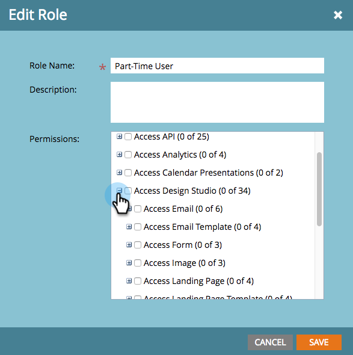
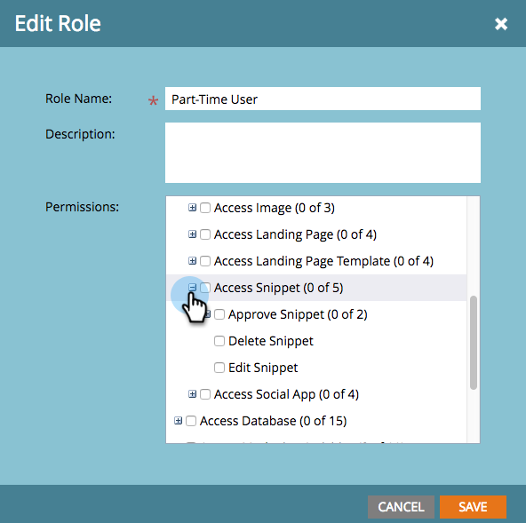
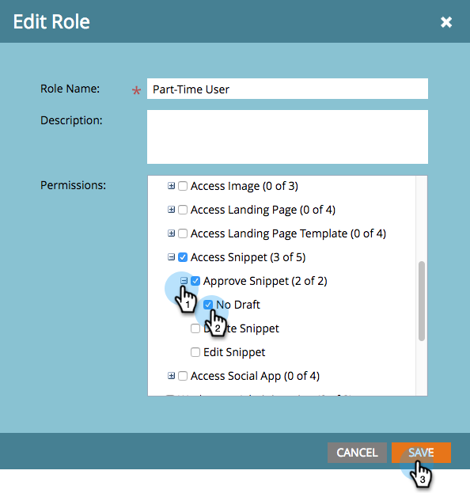

# Enable No-Draft for Snippets {#enable-no-draft-for-snippets}

Enable No-Draft for Snippets - Marketo Docs - Product Documentation

No-Draft for Snippets allows you to distribute snippet changes without drafting approved assets using it. All assets using the edited snippet get the updates and maintain their respective statuses:

* Approved assets get the snippet updates and stay approved

* Drafts get the snippet updates and stay in draft mode

No-Draft is automatically enabled for all Administrator roles. An admin can then enable this feature for any additional role.

>[!NOTE]
>
>**Admin Permissions Required**

1. Go to **Admin** and click **Users & Roles**.

   

1. Go to the **Roles** tab, select a role, then click **Edit Role**.

   

1. Expand the **Access Design Studio** option.

   

1. Expand the **Access Snippet** option.

   

1. Expand the **Approve Snippet** permission and check the **No-Draft** box.&nbsp;Then click **Save**.

   

>[!TIP]
>
>To disable No-Draft, follow steps 1-4 above, clear the No-Draft checkbox, and click **Save**.

>[!NOTE]
>
>**Related Articles**
>
>[Approve a Snippet with No-Draft](../../../../product-docs/personalization/segmentation-and-snippets/snippets/approve-a-snippet-with-no-draft.md)

