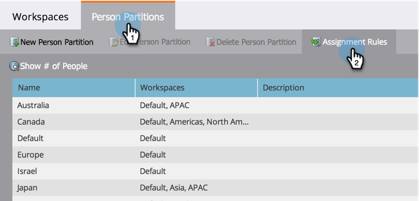

# Assigning Person Partitions with Assignment Rules {#assigning-person-partitions-with-assignment-rules}

Assigning Person Partitions with Assignment Rules - Marketo Docs - Product Documentation

>[!NOTE]
>
>**FYI**
>
>Marketo is now standardizing language across all subscriptions, so you may see lead/leads in your subscription and person/people in docs.marketo.com. These terms mean the same thing; it does not affect article instructions. There are some other changes, too. [Learn more](http://docs.marketo.com/display/DOCS/Updates+to+Marketo+Terminology).

>[!NOTE]
>
>**Admin Permissions Required**

>[!NOTE]
>
>**Prerequisites**
>
>* [Create a Person Partition](create-a-person-partition.md)
>

When using person partitions, set up assignment rules to route people created from your CRM to their respective partitions. 

>[!NOTE]
>
>Only people created in Marketo from your CRM and via the SOAP API will have assignment rules applied to them.

##### 1. Under&nbsp;Admin, click Workspaces & Partitions. {#under-admin-click-workspaces-partitions}

1. Under the **People Partitions **tab, click on **Assignment Rules**.

   

1. Click **Add Choice **to add conditions for routing people into person partitions.

     

1. Select the&nbsp;field the condition should be built on. &nbsp;

   

1. Choose the choice operator and enter a value.
1. 

1. Select the&nbsp;People Partition&nbsp;you want the people that meet the conditions to fall into.

   

   >[!NOTE]
   >
   >
   >You can add as many choices as you like.

   ##### Click&nbsp;Save. {#click-save}

   

And there you have it! You have assigned rules for filling your person partitions with people!

>[!NOTE]
>
>The Default Choice will be applied if none of the previous conditions are met.

