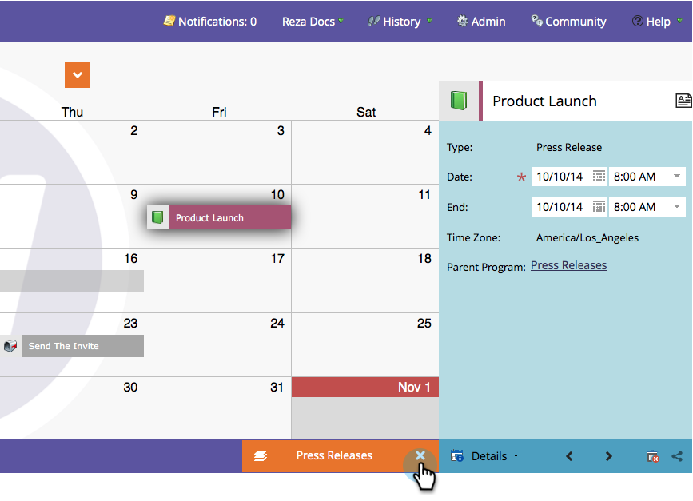

# Understand/Enable Program Focus {#understand-enable-program-focus}

Understand/Enable Program Focus - Marketo Docs - Product Documentation

The Marketing Calendar gives you a bird's-eye view of things, but it also allows some interactions. You can&nbsp; [create](../../../../product-docs/core-marketo-concepts/marketing-calendar/working-with-the-calendar/create-entries-directly-in-the-marketing-calendar.md),&nbsp; [edit](../../../../product-docs/core-marketo-concepts/marketing-calendar/working-with-the-calendar/edit-entries-directly-in-the-marketing-calendar.md),&nbsp; [delete](../../../../product-docs/core-marketo-concepts/marketing-calendar/working-with-the-calendar/delete-entries-directly-in-the-marketing-calendar.md),&nbsp;and&nbsp; [confirm](../../../../product-docs/core-marketo-concepts/marketing-calendar/working-with-the-calendar/confirm-entries-directly-in-the-marketing-calendar.md)&nbsp;entries. In order to interact with entries, you must focus on a program first.

1. Go to the **Marketing** **Calendar**.

   

1. Select an entry and click on **Show Program Focus**.

   

1. Notice we are now focused on our program named "Press Release."

   

   >[!NOTE]
   >
   >Focusing on a program allows you to interact only with entries that belong to it and create new entries that will be housed by it.

1. Once you're done, release focus to interact with other programs/entries.

   

Awesome! Now go ahead and learn to interact with entries.

>[!NOTE]
>
>**Related Articles**
>
>* [Create Entries Directly In the Marketing Calendar](../../../../product-docs/core-marketo-concepts/marketing-calendar/working-with-the-calendar/create-entries-directly-in-the-marketing-calendar.md)
>* [Edit Entries Directly In the Marketing Calendar](../../../../product-docs/core-marketo-concepts/marketing-calendar/working-with-the-calendar/edit-entries-directly-in-the-marketing-calendar.md)
>* [Delete Entries Directly In the Marketing Calendar](../../../../product-docs/core-marketo-concepts/marketing-calendar/working-with-the-calendar/delete-entries-directly-in-the-marketing-calendar.md)
>* [Confirm Entries Directly In the Marketing Calendar](../../../../product-docs/core-marketo-concepts/marketing-calendar/working-with-the-calendar/confirm-entries-directly-in-the-marketing-calendar.md)
>

