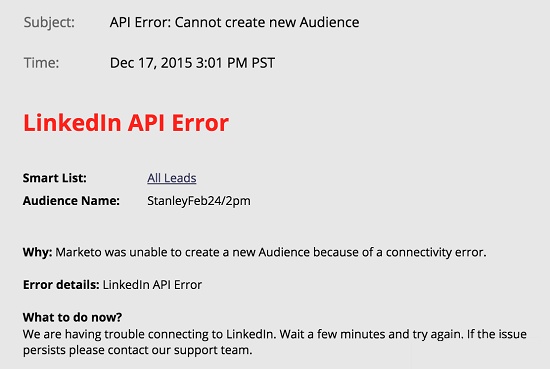

# Notification Types {#notification-types}

Notification Types - Marketo Docs - Product Documentation

eThere are several notification types.

#### Campaign Failure  {#campaign-failure}

Campaign failures notify you of errors in your smart campaigns.

#### CRM Sync {#crm-sync}

CRM sync notifications alert you to critical issues found with the CRM sync, such as incorrect permissions or the sync being down.

**Microsoft Dynamics**

Dynamics notifications are sent once every 24 hours, and contain leads that failed to sync in that time period. Typical reasons for failure are duplicate leads (as above) or field length mismatch errors.

**Salesforce**

If you use Salesforce, sync error notifications look something like the one below. Typical errors include expired credentials and exceeded API limits.

##### Engagement {#engagement}

When leads become exhausted in a stream, we send a notification. &nbsp;The notification includes the number of leads who became exhausted and some other information.

##### Facebook {#facebook}

If you try to send leads to Facebook without accepting the Terms of Service, or if you try to send leads to Facebook after removing the Marketo app.

##### Idle Trigger Campaign Cleanup {#idle-trigger-campaign-cleanup}

Deactivate triggered Smart Campaigns that no longer get any activity. Learn more about&nbsp; [automatic trigger campaign cleanup](../../../../product-docs/core-marketo-concepts/smart-campaigns/using-smart-campaigns/automatic-trigger-campaign-cleanup.md).

##### LinkedIn {#linkedin}

When Marketo is unable to create a new audience, login, or push emails to LinkedIn after three tries.

##### Web Services {#web-services}

You will be notified when you reach your daily quota. The quota resets each night at midnight, Central Time.

>[!NOTE]
>
>Some of the error codes you may receive are outlined in our [Developer Documentation](http://developers.marketo.com/rest-api/error-codes/#response_level_error_codes).

