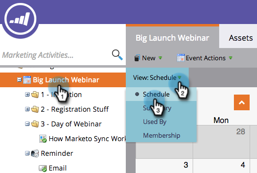
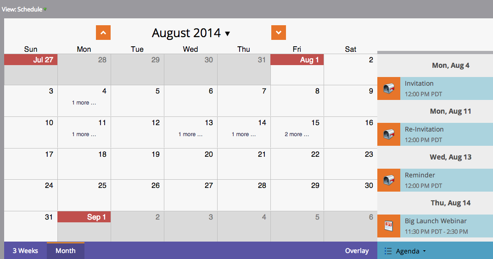
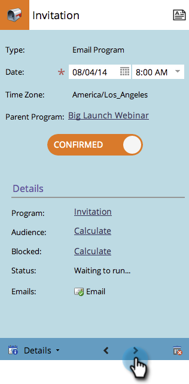

# Navigating the Program Schedule View {#navigating-the-program-schedule-view}

Navigating the Program Schedule View - Marketo Docs - Product Documentation

Here are the basics to help you navigate the program schedule view.

### What's in this article? {#whats-in-this-article}

[Find the Schedule View](#find-the-schedule-view)  
[Switching Between Entries](#switching-between-entries)  
[View Context Menu](#view-context-menu)  
[Changing Between Modes](#changing-between-modes)  
[Full Screen View](#full-screen-view)

#### Find the Schedule View {#find-the-schedule-view}

1. Go to **Marketing Activities**.

   

1. Select your program. Click the **View** drop-down. Select **Schedule**.

   

   Groovy. Now you'll be looking at the schedule view of your program.

   

>[!NOTE]
>
>The program schedule view is sticky. Once you set it, all programs will default to the schedule view.&nbsp;

1. Switching Between Entries
1. In the entry details, click the arrows to move to the next scheduled entry.

   

   Pretty cool, huh?

   

1. View Context Menu
1. Right-click on any program to make edits to the Program, Smart List, Setup, My Tokens, or Members.

   

#### Changing Between Modes {#changing-between-modes}

1. Clicking on **3 Weeks**&nbsp;or **Month** will change the visible dates on your display.

   

#### Full Screen View {#full-screen-view}

1. You can click the screen icon in the upper-right hand corner to view your program schedule in full screen mode.

   

Great! Now that you know how to view your program, let's learn the other cool things it can do.

>[!NOTE]
>
>**Related Articles**
>
>* [Creating an Entry in the Program Schedule View](creating-an-entry-in-the-program-schedule-view.md)
>

