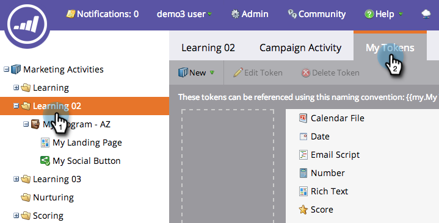
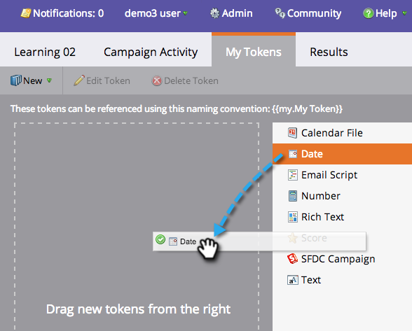
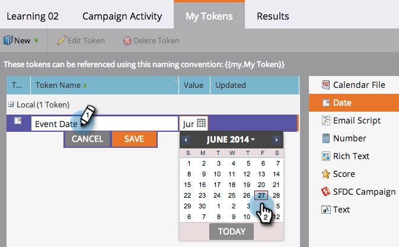
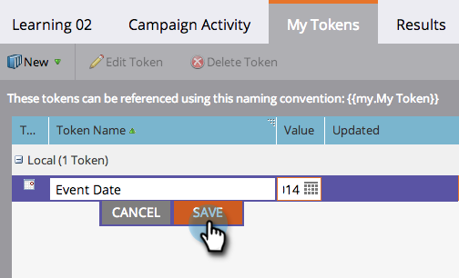
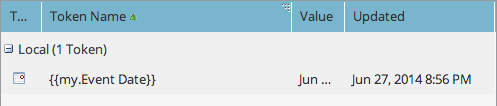
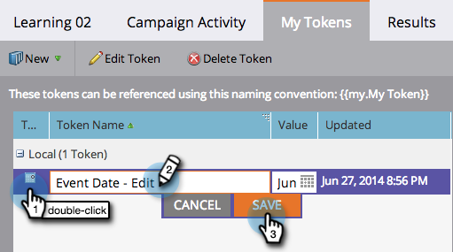
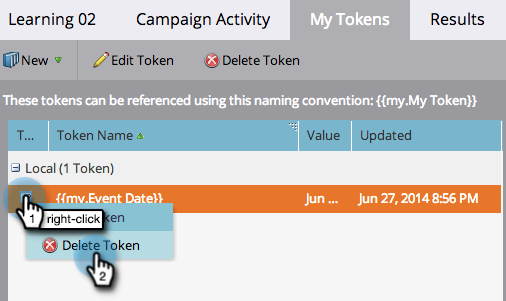
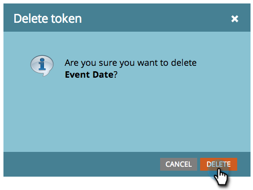

# Managing My Tokens {#managing-my-tokens}

Managing My Tokens - Marketo Docs - Product Documentation

Using tokens can simplify your efforts in Marketo. You can use [My Tokens](understanding-my-tokens-in-a-program.md) (custom tokens) in flow steps, webhooks, emails, and landing pages. Here's how to make them.

>[!TIP]
>
>Learn more about what tokens are already available in [Tokens Overview](../../../../product-docs/demand-generation/landing-pages/personalizing-landing-pages/tokens-overview.md).&nbsp;

### What's in this article? {#whats-in-this-article}

[Create a My Token](#create-a-my-token)  
[Edit a My Token](#edit-a-my-token)  
[Delete a My Token](#delete-a-my-token)

#### Create a My Token {#create-a-my-token}

1. Go to **Marketing Activities.** 

   

1. Select a program or campaign folder. Click **My Tokens.** 

   

1. Select a **My Token** type. Drag and drop it onto the canvas. 

   

1. Type in a unique name. Enter a relevant value for the token. 

   

1. Click **Save.** 

   

   Yay! You made a **My Token.** 

   

#### Edit a My Token {#edit-a-my-token}

1. Double-click the **My Token** and make your changes. Click **Save.** 

   

#### Delete a My Token {#delete-a-my-token}

>[!CAUTION]
>
>When you delete a My Token, make sure you aren't referencing it in any asset. A blank space will display in any place it's referenced if deleted.&nbsp;

1. Right-click the **My Token.** Select **Delete Token.** 

   

1. Click **Delete.** 

   

   >[!NOTE]
   >
   >**Related Articles**
   >
   >    
   >    
   >    * [Tokens Overview](../../../../product-docs/demand-generation/landing-pages/personalizing-landing-pages/tokens-overview.md)
   >    * [Understanding My Tokens in a Program](understanding-my-tokens-in-a-program.md)
   >    * [Using URLs in My Tokens](../../../../product-docs/email-marketing/general/using-tokens/using-urls-in-my-tokens.md)
   >    
   >

