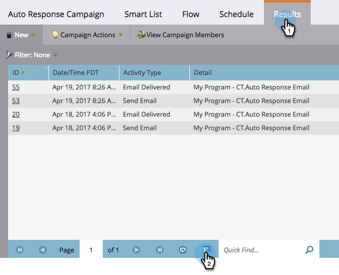

# Export Smart Campaign Results to Excel {#export-smart-campaign-results-to-excel}

Export Smart Campaign Results to Excel - Marketo Docs - Product Documentation

Export your smart campaign results to Excel for use outside of Marketo.

1. In your smart campaign, click on **Results**&nbsp;and then the export icon at the bottom.

   

   In a jiffy, your results are exported and ready to use!

   >[!NOTE]
   >
   >The export is limited to 20,000 rows. The Excel file is saved in your browser's default downloads folder.

