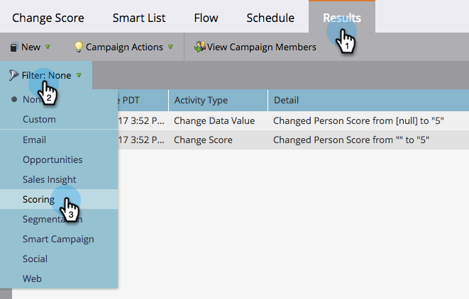
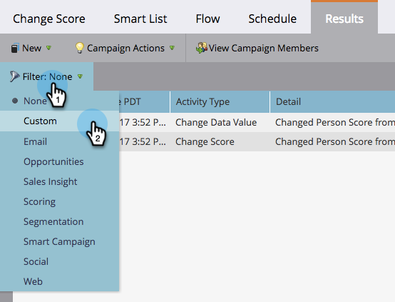

# Filter Smart Campaign Results {#filter-smart-campaign-results}

Filter Smart Campaign Results - Marketo Docs - Product Documentation

>[!NOTE]
>
>**Prerequisites**
>
>* [View Smart Campaign Results](view-smart-campaign-results.md)
>

Filter smart campaign results to see specific activities that matter to you.

### What's in this article? {#whats-in-this-article}

[Filter by Saved Filters](#filter-by-saved-filters)  
[Create a Custom Filter](#create-a-custom-filter)

#### Filter by Saved Filters {#filter-by-saved-filters}

1. In your smart campaign **Results** tab, click on **Filter**&nbsp;and select a saved filter.

   

   >[!NOTE]
   >
   >By default, there are no filters applied and results show all activities.

   #### Create a Custom Filter {#create-a-custom-filter}

1. Click on **Filter**&nbsp;and then **Custom**.

   

1. Select activity types that you want to see and then click on&nbsp;**Save As** .

   

   >[!TIP]
   >
   >Click on&nbsp;**Apply**&nbsp;to directly apply a custom filter to your results without saving it.

1. Enter a filter name and click on **Save**.

   

1. The custom filter will be applied to your results and is now available in the drop-down. (You may have to refresh the page to see it in the drop-down.)

   

   Isn't that cool? Your custom filter is now available for use in all activity logs.

