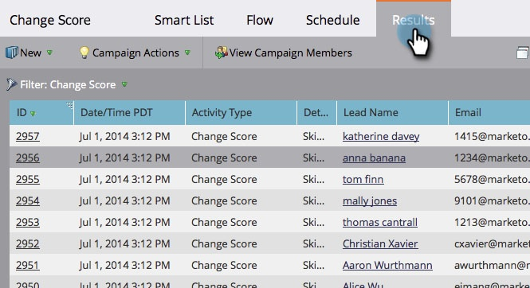

# View Smart Campaign Results {#view-smart-campaign-results}

View Smart Campaign Results - Marketo Docs - Product Documentation

Want to see a breakdown of everything that happened in a smart campaign? It's easy, here's how.

>[!NOTE]
>
>**FYI**
>
>Marketo is now standardizing language across all subscriptions, so you may see lead/leads in your subscription and person/people in docs.marketo.com. These terms mean the same thing; it does not affect article instructions. There are some other changes, too. [Learn more](http://docs.marketo.com/display/DOCS/Updates+to+Marketo+Terminology).

1. In your smart campaign, click **Results**.

   >[!TIP]
   >
   >You can see the list of people who were processed by the smart campaign by clicking&nbsp; [View Campaign Members](view-smart-campaign-members.md).

   

   >[!TIP]
   >
   >You can also filter the results based on activity type. Learn how to&nbsp; [filter smart campaign results](filter-smart-campaign-results.md).

1. Click an **ID**&nbsp;to view more detail about that particular activity.

   

   >[!TIP]
   >
   >View person details by clicking the person's name.

   [export smart campaign results to Excel](export-smart-campaign-results-to-excel.md)

   >[!NOTE]
   >
   >**Related Articles**
   >
   >    
   >    
   >    * [Filter Smart Campaign Results](filter-smart-campaign-results.md)
   >    * [Export Smart Campaign Results to Excel](export-smart-campaign-results-to-excel.md)
   >    
   >

Dig into the results to see what your campaign actually did, or simply . 