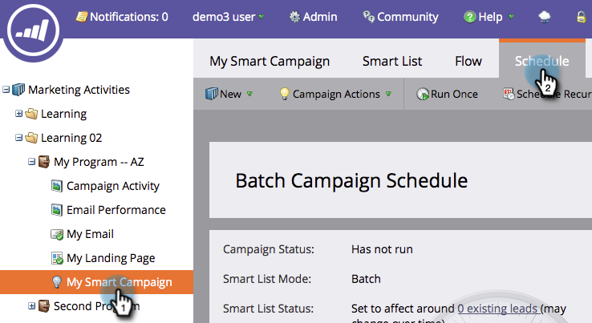
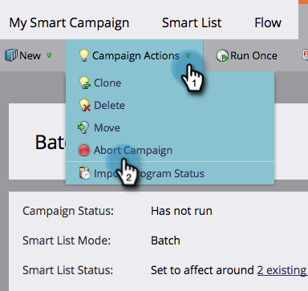

# Abort a Smart Campaign {#abort-a-smart-campaign}

Abort a Smart Campaign - Marketo Docs - Product Documentation

>[!CAUTION]
>
>For Emergency Use Only

Sometimes you launch a smart campaign and immediately realize it was a mistake. Here's how to pull the emergency brake and stop the smart campaign mid-run.

1. Under **Marketing Activities**, select your smart campaign and go to the **Schedule** tab.

   

1. Click the** Campaign Actions** drop-down. Select **Abort Campaign**.

   

1. Click **Abort** to confirm.

   

   >[!NOTE]
   >
   >**Reminder**
   >
   >
   >Aborting does not undo steps already finished, it just stops more from happening. (Example: Emails can't be undelivered.)

   

   >[!NOTE]
   >
   >Take a look at the **Results** tab of the smart campaign to see what actions took place before the abort. You will also find a&nbsp; [notification](../../../../product-docs/core-marketo-concepts/miscellaneous/understanding-notifications.md) with additional details.

   >[!TIP]
   >
   >Want to remove a person from the flow in a trigger campaign? Check out [Remove from Flow](../../../../product-docs/core-marketo-concepts/smart-campaigns/flow-actions/remove-from-flow.md).

Always double-check your work, but this emergency brake may come in handy in the future. 