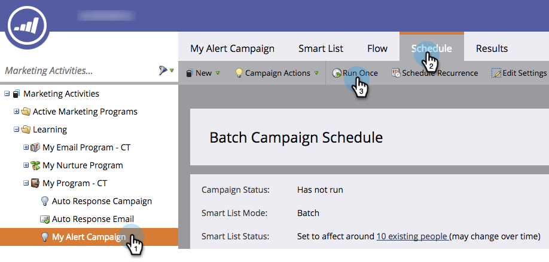

# Run a Batch Smart Campaign Now | Schedule Tab {#run-a-batch-smart-campaign-now-schedule-tab}

Run a Batch Smart Campaign Now | Schedule Tab - Marketo Docs - Product Documentation

Once you are done building your batch campaign, you can choose to run it now or later. Here's how to run it immediately.

1. Select the batch smart campaign, go to the **Schedule** tab and click **Run Once**.

   

1. Make sure **Run Now **is selected and click **Run**.

   

1. Confirm by clicking **Run** one more time.

   

   Easy peasy! You can also [schedule runs for later](schedule-a-batch-smart-campaign-to-run-later.md) if you prefer.

   >[!NOTE]
   >
   >**Related Articles**
   >
   >    
   >    
   >    * [Schedule a Batch Smart Campaign to Run Later](schedule-a-batch-smart-campaign-to-run-later.md)
   >    * [Schedule a Recurring Batch Campaign](schedule-a-recurring-batch-campaign.md)
   >    
   >

