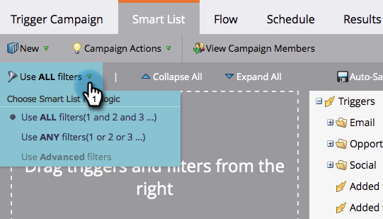
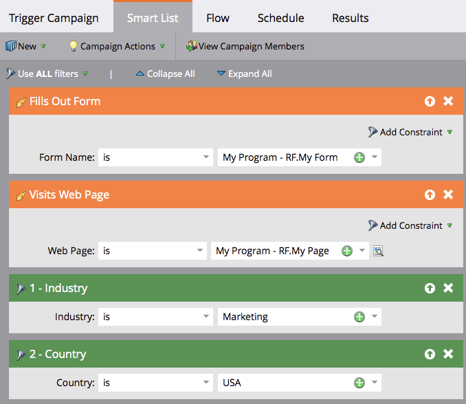

# Using Standard Smart List Rule Logic {#using-standard-smart-list-rule-logic}

Using Standard Smart List Rule Logic - Marketo Docs - Product Documentation

You may have noticed the "Use filters" option when building campaign smart lists. This setting allows you to decide if the filters need to be evaluated with an AND or an OR operator.&nbsp;

>[!NOTE]
>
>**FYI**
>
>Marketo is now standardizing language across all subscriptions, so you may see lead/leads in your subscription and person/people in docs.marketo.com. These terms mean the same thing; it does not affect article instructions. There are some other changes, too. [Learn more](http://docs.marketo.com/display/DOCS/Updates+to+Marketo+Terminology).

>[!NOTE]
>
>Changing smart list rule logic only applies to filters, **not** triggers.

Triggers are always evaluated as OR even if the above setting is set to ALL.  Here's an example:

The above smart list in words:
`<pre data-theme="Confluence">IF person fills out My Form OR IF person visits My Page AND Industry is Marketing AND Country is USA THEN follow the campaign's flow step(s)</pre>` So, if a person fills out the form **or** visits the page, the campaign will then evaluate that person based on **all **or **any **of the subsequent filters, depending on the setting used.

>[!NOTE]
>
>**Related Articles**
>
>* [Using Advanced Smart List Rule Logic](../../../../product-docs/core-marketo-concepts/smart-lists-and-static-lists/using-smart-lists/using-advanced-smart-list-rule-logic.md)
>

