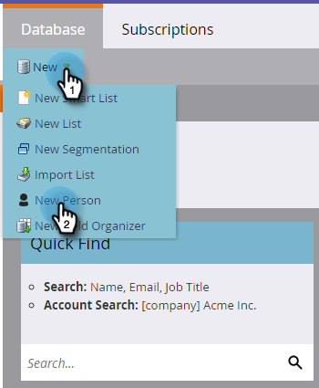

# Create a Person Manually {#create-a-person-manually}

Create a Person Manually - Marketo Docs - Product Documentation

There are many ways to get a person into Marketo. If you need to create one manually, here's how to do it.

>[!NOTE]
>
>**FYI**
>
>Marketo is now standardizing language across all subscriptions, so you may see lead/leads in your subscription and person/people in docs.marketo.com. These terms mean the same thing; it does not affect article instructions. There are some other changes, too. [Learn more](http://docs.marketo.com/display/DOCS/Updates+to+Marketo+Terminology).

1. Go to the **Database**.

   

1. Under **New**, click **New Person**.

   

1. Enter the person's information, then click **Create**.

   

This is a quick and easy way to add a single person in Marketo! 