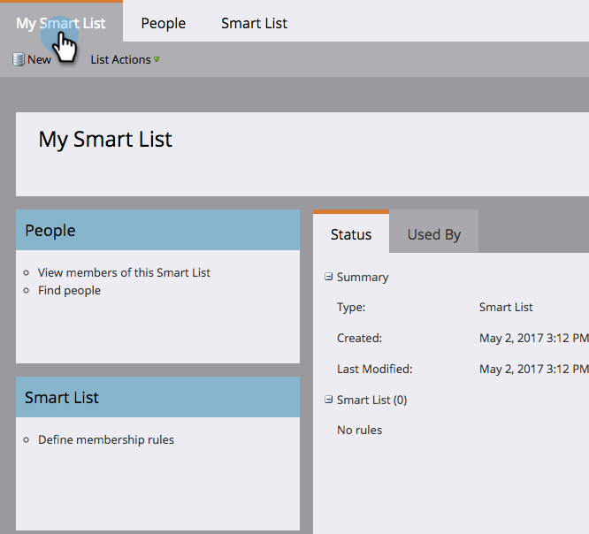

# Understanding Smart Lists {#understanding-smart-lists}

Understanding Smart Lists - Marketo Docs - Product Documentation

Smart lists allow you to find specific groups of people using simple filters. They are used all over Marketo, such as in [smart campaigns](../../../product-docs/core-marketo-concepts/smart-campaigns.md), [programs](../../../product-docs/core-marketo-concepts/programs.md), [reports](../../../product-docs/reporting/basic-reporting.md), [segmentations](../../../product-docs/personalization/segmentation-and-snippets.md), [business models](../../../product-docs/reporting/revenue-cycle-analytics/revenue-cycle-models.md), [engagement programs](../../../product-docs/email-marketing/drip-nurturing.md), [dynamic content](../../../product-docs/personalization/segmentation-and-snippets.md), and more. Depending on your needs, smart lists can be created in two places within Marketo:

1. In the **Database**, where they're available for shared/global use (e.g., "All Unsubscribed People").
1. In **programs **as local assets, where they find a group of people who are relevant to that specific program (e.g., "Attended Tradeshow").

The main steps to creating a smart list are:

1. [Create a Smart List](creating-a-smart-list/create-a-smart-list.md)
1. [Find and Add Filters to a Smart List](creating-a-smart-list/find-and-add-filters-to-a-smart-list.md)
1. [Define Smart List Filters](creating-a-smart-list/define-smart-list-filters.md)

Here's an example of what a smart list looks like.

#### Main Tab {#main-tab}

Here you can [edit the smart list name](../../../product-docs/core-marketo-concepts/miscellaneous/rename-a-marketo-asset.md) and see information about the smart list.

#### People Tab {#people-tab}

This is where you see your results; i.e., all the people who qualify for the filters you [added and defined](creating-a-smart-list/find-and-add-filters-to-a-smart-list.md) under the Smart List tab.

#### Smart List Tab {#smart-list-tab}

You add and define the filters to see a specific group of people in the People tab.

OK, let's get started!

>[!NOTE]
>
>**Related Articles**
>
>* [Use Built-in/System Smart Lists](using-smart-lists/use-built-in-system-smart-lists.md)
>* [Create a Smart List](creating-a-smart-list/create-a-smart-list.md)
>

