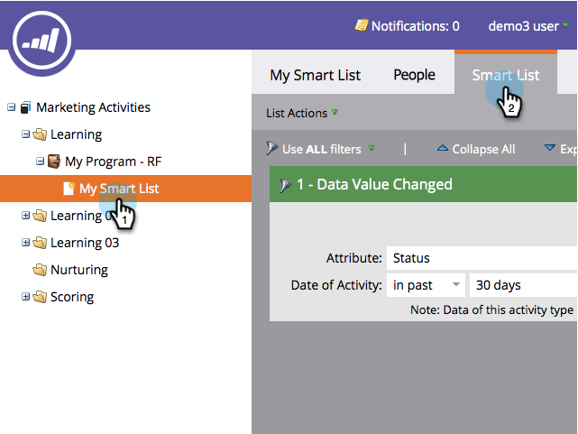
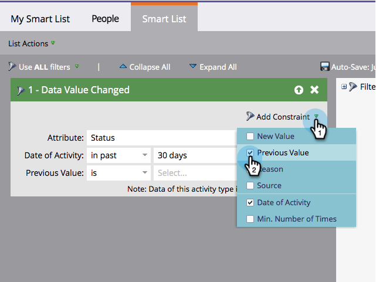
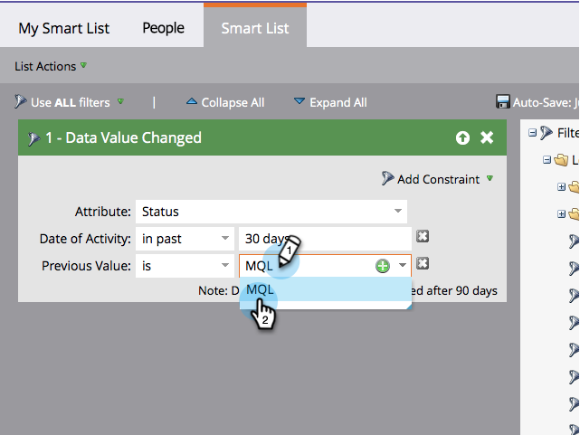
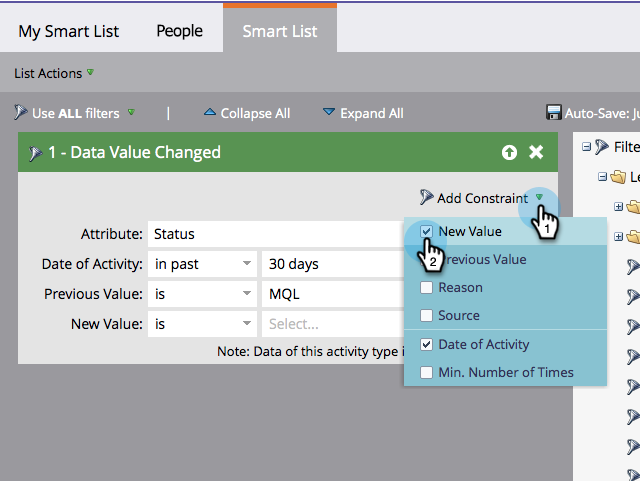
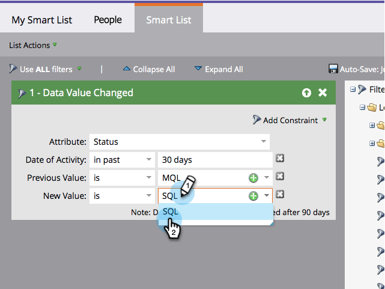

# Add a Constraint to a Smart List Filter {#add-a-constraint-to-a-smart-list-filter}

Add a Constraint to a Smart List Filter - Marketo Docs - Product Documentation

When creating smart lists, some filters have advanced options called *constraints. *These&nbsp;are extra conditions that you can add to filters and triggers&nbsp;to help narrow your search even further.

In this example, let's add some constraints to a ** [Data Value Changed](../../../../product-docs/core-marketo-concepts/smart-campaigns/flow-actions/change-data-value.md)** filter to find people that had a Status change from MQL to SQL.

>[!NOTE]
>
>**FYI**
>
>Marketo is now standardizing language across all subscriptions, so you may see lead/leads in your subscription and person/people in docs.marketo.com. These terms mean the same thing; it does not affect article instructions. There are some other changes, too. [Learn more](http://docs.marketo.com/display/DOCS/Updates+to+Marketo+Terminology).

>[!NOTE]
>
>**Prerequisites**
>
>* [Create a Smart List](../../../../product-docs/core-marketo-concepts/smart-lists-and-static-lists/creating-a-smart-list/create-a-smart-list.md)
>* [Use the "Data Value Changed" Filter in a Smart List](use-the-data-value-changed-filter-in-a-smart-list.md)
>

1. Go to&nbsp;**Marketing Activities**.

   

1. Select the smart list with a filter you'll be adding a constraint to, and click the **Smart List** tab.

   

1. Under **Add Constraint**, select **Previous Value**.

   

1. Enter the **Previous Value**. In this example we're using MQL.

   

1. Under **Add Constraint**, select **New Value**.

   

1. Enter the **New Value**. In this example we're using SQL.

   

1. Nicely done! Click the **People** tab to see all people who had a **Status** change from **MQL** to **SQL** in the past 30 days.

