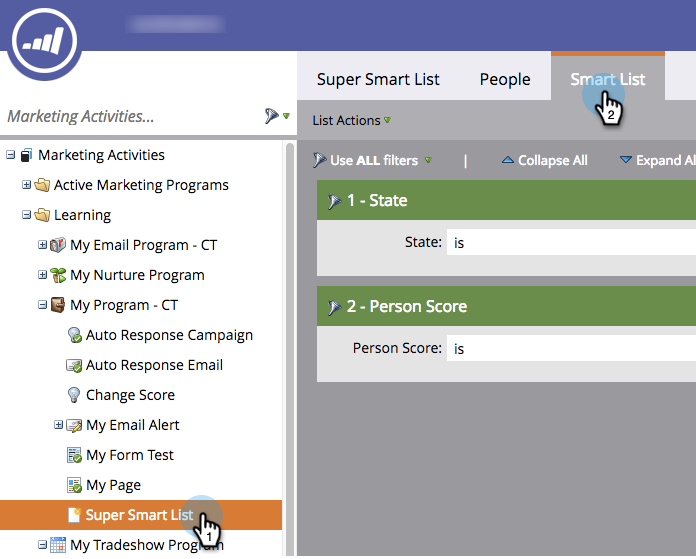
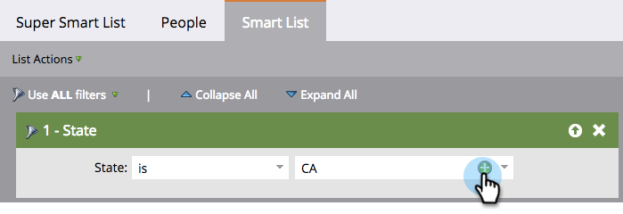

# Add Multiple Values to a Smart List Filter {#add-multiple-values-to-a-smart-list-filter}

Add Multiple Values to a Smart List Filter - Marketo Docs - Product Documentation

>[!NOTE]
>
>**Prerequisites**
>
>* [Create a Smart List](../../../../product-docs/core-marketo-concepts/smart-lists-and-static-lists/creating-a-smart-list/create-a-smart-list.md)
>* [Find and Add Filters to a Smart List](../../../../product-docs/core-marketo-concepts/smart-lists-and-static-lists/creating-a-smart-list/find-and-add-filters-to-a-smart-list.md)
>

Let's say you want to find everyone in California, but you might be storing both **California** and **CA** in your Database. To include all applicable people, you could use two&nbsp;**State**&nbsp;filters, but it's easier with one.

1. Go to **Marketing Activities**.

   

1. Find and select a smart list and click the **Smart List** tab.

   

1. Click the **plus sign** on the filter. 

   

1. You can choose values from the left or just type them on the right then click **OK**.

   

   Quick work!

>[!NOTE]
>
>**Related Articles**
>
>* [Add a Constraint to a Smart List Filter](add-a-constraint-to-a-smart-list-filter.md)
>* [Use Advanced Filters in a Smart List](using-advanced-smart-list-rule-logic.md)
>

