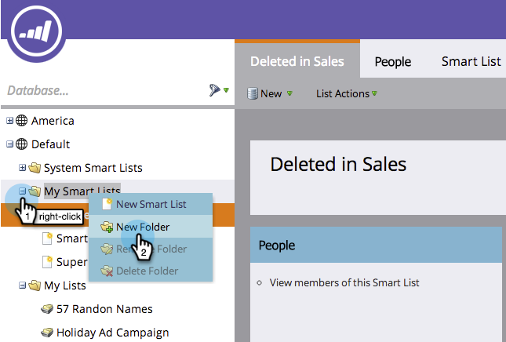

# Reference a List or Smart List Across Workspaces {#reference-a-list-or-smart-list-across-workspaces}

Reference a List or Smart List Across Workspaces - Marketo Docs - Product Documentation

Lists and smart lists can be shared and referenced across workspaces for easy reuse from the Database.

>[!NOTE]
>
>Person partition rules apply (smart lists and static lists in a workspace only show people who are both members of the list *and* members of the current workspace).

#### Share a List or Smart List  {#share-a-list-or-smart-list}

1. Go to the **Database**.

   

1. Right-click a campaign folder. Select **New Folder**.

   >[!NOTE]
   >
   >Assets can only be shared across workspaces if they are nested in a folder.

   

1. Drag and drop a list or smart list you want to share into the new folder.

   

1. Right-click **New Folder** and select **Share Folder**.

   

1. Choose a **Workspace **to share with. Select **Save**.

   

   Awesome! This list will now be available in both workspaces.

   >[!NOTE]
   >
   >In Marketing Activities, you can only share top-level folders. In Database, you can share top-level folders as well as one level down.

