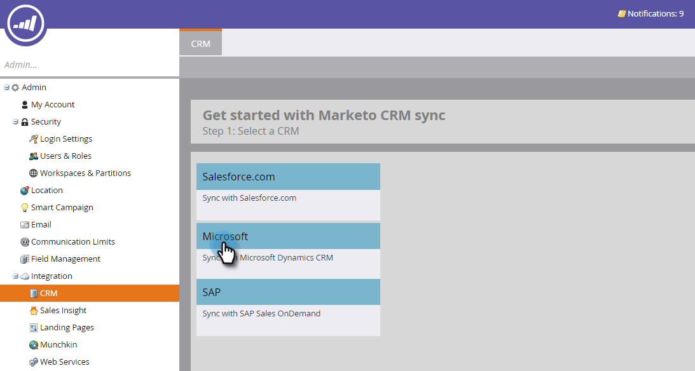
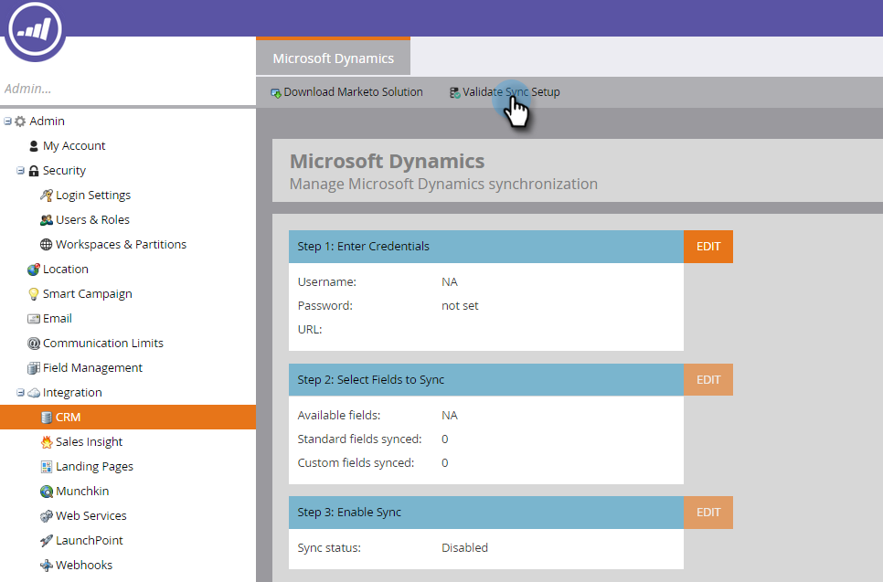
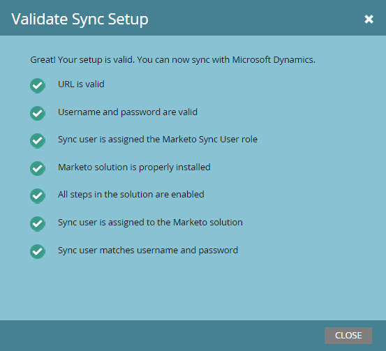

# Validate Microsoft Dynamics Sync {#validate-microsoft-dynamics-sync}

Validate Microsoft Dynamics Sync - Marketo Docs - Product Documentation

>[!CAUTION]
>
>If you have Multi-Factor Authentication (MFA) enabled for your Dynamics Sync, you must disable it in order for Dynamics to properly sync with Marketo. For additional information, please contact [Marketo Support](http://nation.marketo.com/community/support_solutions).

#### Run Validate Sync in Marketo {#run-validate-sync-in-marketo}

It's very important to run the Validate Sync tool to make sure your Microsoft Dynamics Sync with Marketo is set up correctly before making the final connection between them. The process generates a checklist of seven setup steps that pinpoint where issues exist. Verifying these were done correctly can save a lot of time later.

1. Click the **Admin** tab and then the **Microsoft Dynamics** link in the Integration area.

   

1. Select **Microsoft**.

   

1. Click the **Validate Sync Setup** tab.

   

1. Enter your Username, Password, and URL (Client Id and Client Secret are optional). Click **Next** when done.

   

   >[!NOTE]
   >
   >If you've synced before, **CRM** in the left tree will read **Microsoft Dynamics**, and the data in the above form may be prepopulated.

1. If everything is fine, the Validate Sync generates a checklist full of green checkmarks .

   

1. If you see an , then that step has an issue. See [Fix Dynamics Validation Sync Issues](validate-microsoft-dynamics-sync/fix-dynamics-validation-sync-issues.md) to identify and fix the problem. Then rerun the sync validation steps until the result looks like the image above.

   >[!CAUTION]
   >
   >We do not currently support sandbox refresh for Marketo Dynamics Sync. If you need to refresh your Dynamics CRM sandbox, a new Marketo sandbox will be required. Please contact your Customer Success Manager for additional details.

>[!NOTE]
>
>**Related Articles**
>
>[Fix Dynamics Validation Sync Issues](validate-microsoft-dynamics-sync/fix-dynamics-validation-sync-issues.md)

