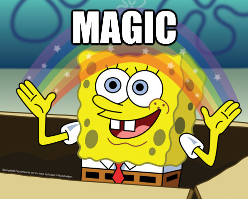

# SFDC Sync: Deleting a Lead/Contact {#sfdc-sync-deleting-a-lead-contact}

SFDC Sync: Deleting a Lead/Contact - Marketo Docs - Product Documentation

>[!NOTE]
>
>**FYI**
>
>Marketo is now standardizing language across all subscriptions, so you may see lead/leads in your subscription and person/people in docs.marketo.com. These terms mean the same thing; it does not affect article instructions. There are some other changes, too. [Learn more](http://docs.marketo.com/display/DOCS/Updates+to+Marketo+Terminology).

Here are some of the details:

* Marketo doesn't&nbsp;automatically&nbsp;delete people just because leads were deleted in Salesforce.&nbsp;Rather a field “SFDC Is Deleted” flag is set to true. You can trigger off this field to delete in Marketo if desired.
* [Delete Person](../../../../product-docs/core-marketo-concepts/smart-campaigns/flow-actions/delete-person.md) flow action. This deletes a person in MKTO but you have a choice to delete in `Salesforce` too.

* [Delete From SFDC](../../../../product-docs/core-marketo-concepts/smart-campaigns/salesforce-flow-actions/delete-person-from-sfdc.md) flow action: This deletes a lead in SFDC but you have a choice to delete a person in Marketo as well.
* If a lead is deleted in Salesforce (but a person is not deleted in Marketo) and then subsequently runs through the [Sync with Salesforce](../../../../product-docs/core-marketo-concepts/smart-campaigns/salesforce-flow-actions/sync-person-to-sfdc.md) flow action, then it would create a new lead in Salesforce.

In other words, it works like magic!

