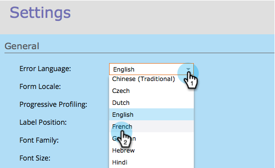
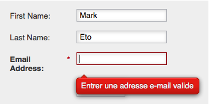

# Change the Language of Form Validation/Error Messages and Submit Button {#change-the-language-of-form-validation-error-messages-and-submit-button}

Change the Language of Form Validation/Error Messages and Submit Button - Marketo Docs - Product Documentation

Did you know you can customize the form to give messages in another language? Check this out.

>[!NOTE]
>
>This also changes the submit button language.

1. Go to **Marketing** **Activities**.

   

1. Select your form and click **Edit Form.**

   

1. Under **Form Settings,** click **Settings**.

   

1. Select the **Error** **Language** you need.

   

1. Click **Finish**.

   

1. Click **Approve and Close** to apply and save changes.

   >[!NOTE]
   >
   >The form must be approved to be used on landing pages.

   

   >[!NOTE]
   >
   >**Reminder**
   >
   >
   >Remember to [approve the landing page](../../../../product-docs/demand-generation/landing-pages/understanding-landing-pages/approve-unapprove-or-delete-a-landing-page.md) draft created by the form changes.

   

And voila! The form validation and error messages will now be displayed in your preferred language. 