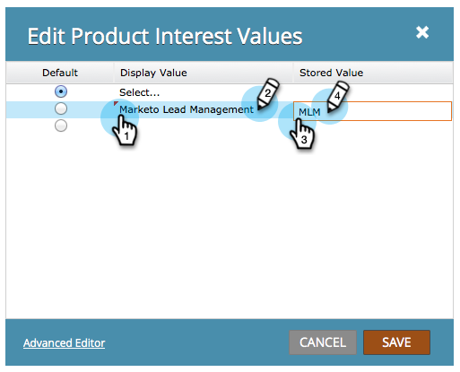

# Define Values in a Radio or Selected Field in a Form {#define-values-in-a-radio-or-selected-field-in-a-form}

Define Values in a Radio or Selected Field in a Form - Marketo Docs - Product Documentation

Once you've [set a field type](../../../../product-docs/administration/field-management/change-the-type-of-a-marketo-custom-field.md) to be a radio button or select type, you'll want to define the values the user can pick from. Here's how.

1. Go to **Marketing** **Activities**. 

   

1. Select your form and click **Edit** **Form**.

   

1. Select the field and click **Edit**.

   

   >[!NOTE]
   >
   >The first and default value is always&nbsp;"Select..."&nbsp;Feel free to edit that. If you change the default radio button to another row, "Select..." will not show up as a choice in the form.

1. Click to add your value.

   

   >[!NOTE]
   >
   >**Definition**
   >
   >
   >**Display Value:** What is shown to the visitor.
   >
   >
   >**Stored Value:** What is recorded in Marketo.

1. Add as many values as you need, then click **Save**.

   >[!NOTE]
   >
   >If you don't enter a&nbsp;Stored Value, Marketo will use the&nbsp;Display Value&nbsp;and store that.

   

   >[!TIP]
   >
   >Click **Advanced Editor**&nbsp;to copy/paste a list of values if you want. It can be a real time saver.

1. Click **Finish**. 

   

1. Click **Approve and Close**.

   

Super work! You're doing really well. Learn more about [forms](../../../../product-docs/demand-generation/forms.md).
