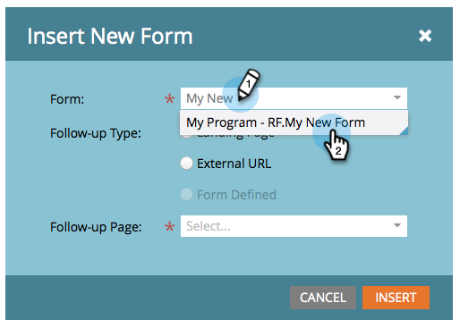

# Add a New Form to a Free-Form Landing Page {#add-a-new-form-to-a-free-form-landing-page}

Add a New Form to a Free-Form Landing Page - Marketo Docs - Product Documentation

Form, meet landing page. Landing page, meet form.

>[!NOTE]
>
>**Prerequisites**
>
>* [Create a Form](../../../../product-docs/demand-generation/forms/creating-a-form/create-a-form.md)
>* [Create a Free-Form Landing Page](create-a-free-form-landing-page.md)
>

1. Go to **Marketing** **Activities**.

   

1. Find your landing page and click **Edit** **Draft**.

   

1. Drag and drop the **Form** element onto the page.

   

1. Find and select the form you want to add.

   

1. You have three options when choosing your follow-up page:

    * **Landing Page** - to pick a Marketo landing page
    * **External**** URL** - to pick any URL you want
    
    * **Form**** Defined** - to use the settings defined at the form level

   >[!NOTE]
   >
   >**Definition**
   >
   >
   >The follow-up page is the page people will see after they submit the form.

1. Click **Insert**.

   

   Nicely done!

Just close the landing page editor and [approve the landing page draft](../../../../product-docs/demand-generation/landing-pages/understanding-landing-pages/approve-unapprove-or-delete-a-landing-page.md).
