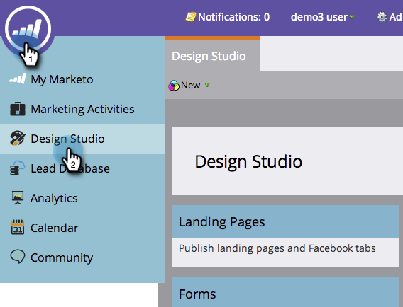
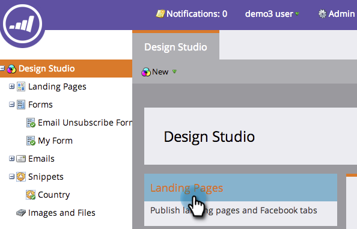
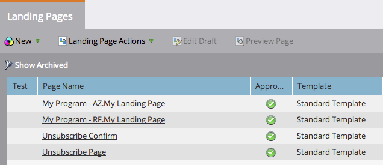

# Approve Multiple Landing Pages at Once {#approve-multiple-landing-pages-at-once}

Approve Multiple Landing Pages at Once - Marketo Docs - Product Documentation

1. Go to **Design Studio.**

   

1. Click **Landing Pages.**

   

1. Hold Ctrl (Windows) or Command (Mac) and click to select multiple landing pages.

   

   >[!TIP]
   >
   >Do not click the actual landing page name, those are links and will take you to the page itself.

1. With your landing pages selected, go to **Landing Page Actions** and click on **Approve.**

   

   There you go! You can now quickly and easily approve multiple landing pages.

   

   >[!TIP]
   >
   >You can also use the steps above for other bulk options, such as unapprove or delete.

