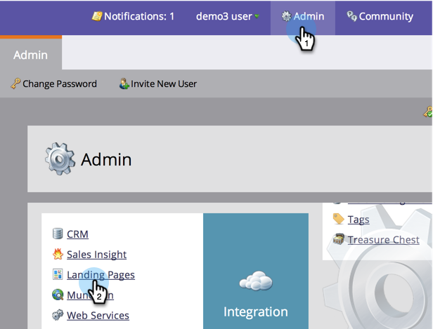
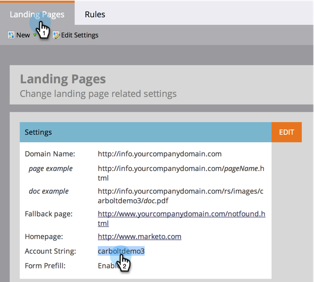
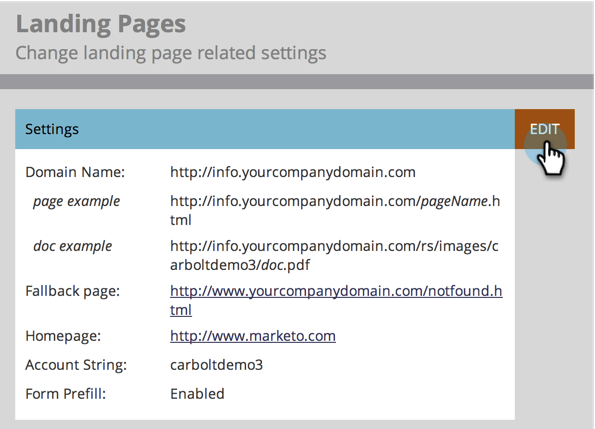

# Customize Your Landing Page URLs with a CNAME {#customize-your-landing-page-urls-with-a-cname}

Customize Your Landing Page URLs with a CNAME - Marketo Docs - Product Documentation

Even though Marketo hosts your landing pages, the URL can be totally customized. What it looks like without a CNAME:
`<pre data-theme="Confluence">http://na-sj02.marketo.com/lp/mktodemoaccount126/UnsubscribePage.html</pre>` The way it should look:
`<pre data-theme="Confluence"> http://go.YourCompany.com/UnsubscribePage.html</pre>` 

### What's in this article? {#whats-in-this-article}

[Choose a CNAME](#choose-a-cname)  
[Find your Account String](#find-your-account-string)  
[Send Request to IT](#send-request-to-it)  
[Complete CNAME Setup](#complete-cname-setup)

#### Choose a CNAME {#choose-a-cname}

Pick a word to go at the beginning of the URL for your landing pages. It's just one word and should be relatively short. Examples:

* go. [YourCompany.com/NameOfPage.html](http://YourCompany.com/NameOfPage.html)
* info. [YourCompany.com/NameOfPage.html](http://YourCompany.com/NameOfPage.html)
* pages. [YourCompany.com/NameOfPage.html](http://YourCompany.com/NameOfPage.html)

The one word (plus [YourCompany.com](http://YourCompany.com)) is called a CNAME. You will need this later so make a note of it.

#### Find your Account String {#find-your-account-string}

1. Go to the **Admin** area and click on **Landing Pages.**

   

   >[!NOTE]
   >
   >**Admin Permissions Required**

1. Under the **Landing** **Pages** tab, copy the **Account** **String** from the **Settings** section.

   

1. You will need later also, so make a note of it.

#### Send Request to IT {#send-request-to-it}

Ask your IT staff to setup the following CNAME: (Replace the word [CNAME] and [ACCOUNT STRING] with the text from the previous step.)

[CNAME]. [YourCompany.com](http://yourcompany.com/) > [ACCOUNT STRING]. [mktoweb.com](http://mktoweb.com/)

#### Complete CNAME Setup {#complete-cname-setup}

1. Once your IT has created the CNAME, go to **Admin** and click on **Landing** **Pages**.

   

1. Under the **Settings** section, click on **Edit**.

   

1. Enter your CNAME in **Domain** **name** **for** **Landing** **Pages**, enter your **Fallback** **page**, enter your **Homepage** and click **Save**. 

   

>[!NOTE]
>
>Your fallback page will be the page leads will get redirected to if your Marketo&nbsp;Landing Page is unavailable.

Nice job! Your landing pages are now branded with your company domain. 