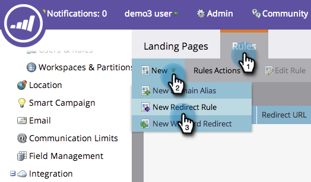

# Redirect a URL Path {#redirect-a-url-path}

Redirect a URL Path - Marketo Docs - Product Documentation

Marketo makes it easy to redirect a URL path to any page you choose. Here's how.

>[!NOTE]
>
>**Admin Permissions Required**

1. Under&nbsp;**Admin,**&nbsp;click&nbsp;**Landing Pages**.

   

1. Click the **Rules** tab, then click **New **and **New Redirect Rule**.

   

1. Click the first&nbsp;**Original URL**&nbsp;drop-down and select your&nbsp;Marketo CNAME.

   

   >[!NOTE]
   >
   >**Reminder**
   >
   >
   >Remember, you can only redirect URLs that start with your Marketo [CNAME](../../../../product-docs/demand-generation/landing-pages/landing-page-actions/customize-your-landing-page-urls-with-a-cname.md).

1. Type&nbsp;the URL path (or specific page) you want to redirect in&nbsp;the second&nbsp;**Original URL**&nbsp;field on the right.

   

1. Click&nbsp;**Use non-Marketo Landing Page**, type the page you want to redirect visitors to in the&nbsp;**Redirect URL**&nbsp;field, and click&nbsp;**Create**.

   

   You can [use Marketo landing pages](https://docs.marketo.com/x/vAEk) as the destination too.

Congratulations! &nbsp;You've successfully redirected your URL path.

>[!NOTE]
>
>**Related Articles**
>
>* [Redirect a Marketo Landing Page to Another Page](../../../../product-docs/demand-generation/landing-pages/landing-page-actions/redirect-a-marketo-landing-page-to-another-page.md)
>

