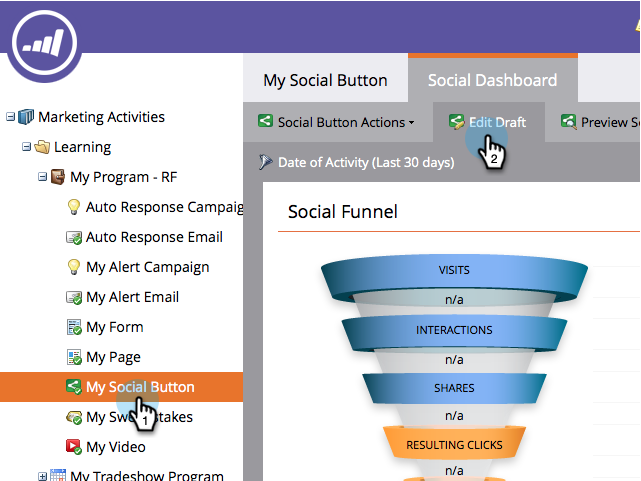
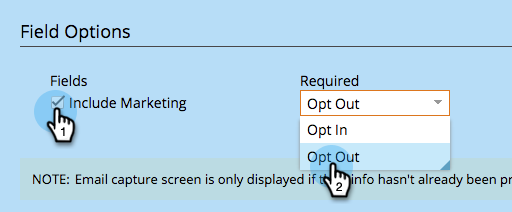
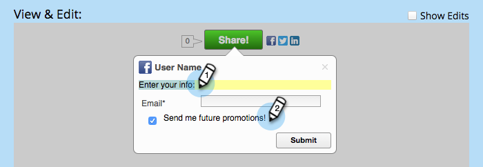

# Configure After-Share Prompts {#configure-after-share-prompts}

Configure After-Share Prompts - Marketo Docs - Product Documentation

In social button, video share, and poll&nbsp;apps, you can choose what happens after a person shares your content on their social network.

1. Go to **Marketing Activities**.

   

1. Select the app, and click **Edit Draft**.

   

1. In the social app editor, go to&nbsp;**App Settings****&nbsp;**and then **Advanced Options**.

   

1. For **After Share**, select the behavior you want.

   

    * **Confirmation Message:** Once the person has shared, display a confirmation.
    * **Email Capture:** Once the person has shared, request their email address.

   >[!NOTE]
   >
   >If you choose&nbsp;**Email Capture**, the request is only displayed if the person has not already provided their information.

1. If you chose&nbsp;**Confirmation Message:** Go to&nbsp;**Share Flow**&nbsp;and then&nbsp;**Confirmation Message**.

   

1. Edit the confirmation message.

   

1. If you chose **Email Capture** (instead of confirmation): Go to **Share Flow** and then **Email Capture**.

   

1. Choose whether to include a marketing prompt, and whether that checkbox is selected by default (**Opt Out**) or not (**Opt In**).

   

1. Edit the request for email address and the marketing prompt (if you included it).

   

