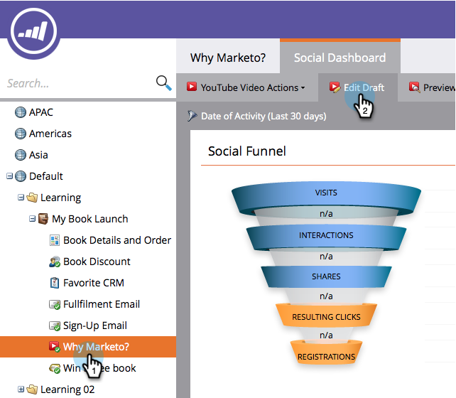
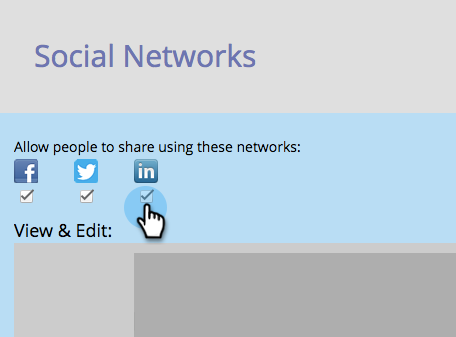
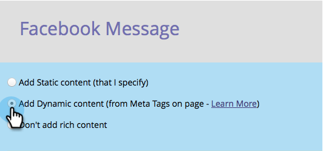
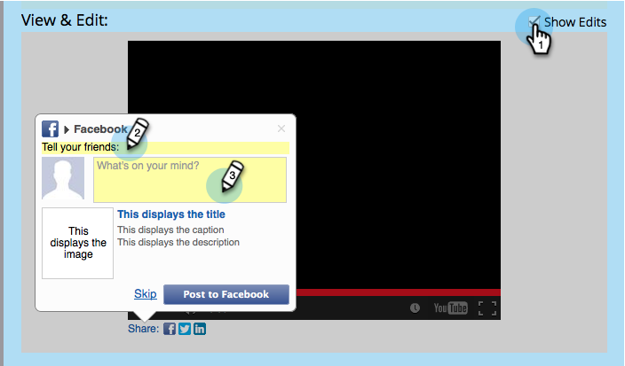
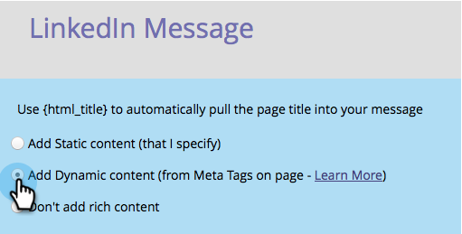
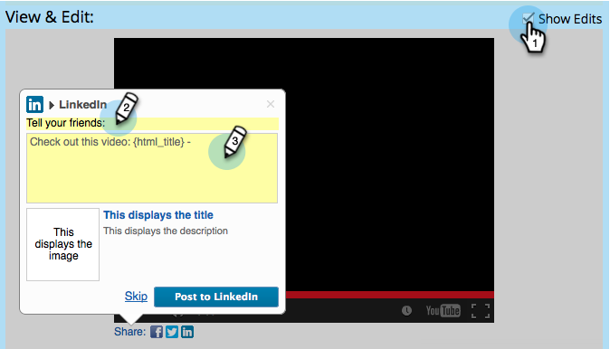
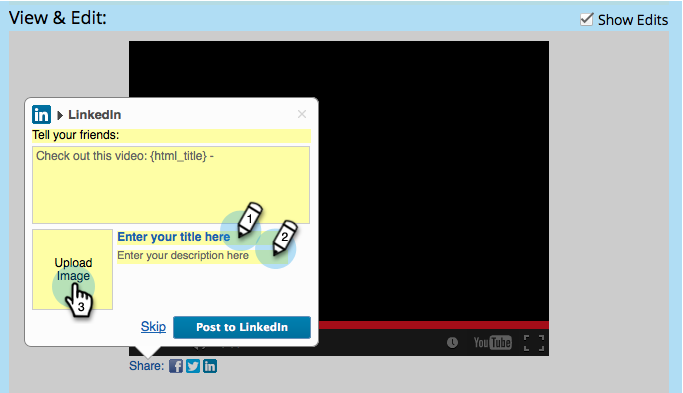
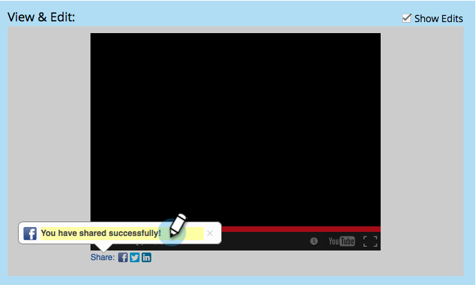
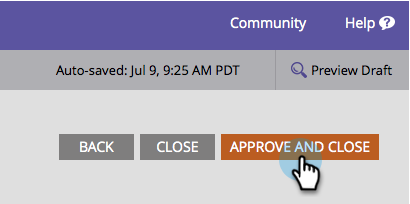

# Configure Social Recommend Flow {#configure-social-recommend-flow}

Configure Social Recommend Flow - Marketo Docs - Product Documentation

When you create a&nbsp;social app, you can configure the social network choices and prompts that a user encounters as they sign up.

### What's in this article? {#whats-in-this-article}

[Select Networks for Sharing](#select-networks-for-sharing)  
[Configure the Facebook Message](#configure-the-facebook-message)  
[Configure the Twitter Message](#configure-the-twitter-message)  
[Configure the LinkedIn Message](#configure-the-linkedin-message)  
[Configure the Confirmation Message](#configure-the-confirmation-message)

#### Select Networks for Sharing {#select-networks-for-sharing}

>[!NOTE]
>
>This is very similar to&nbsp; [configuring the social sign-up/share flow](configure-social-sign-up-share-flow.md), but&nbsp;this is for the share links&nbsp;*under*&nbsp;the social app.

1. Go to **Marketing Activities**.

   

1. Select the app, and click **Edit Draft****.**

   

1. In the social app editor, go to **Recommend Flow** > **Social Networks****.**

   

1. Select the networks a user can share to.

   

#### Configure the Facebook Message {#configure-the-facebook-message}

1. Configure the message that will appear in Facebook posts.

   

   >[!NOTE]
   >
   >In a video share, the thumbnail is generated automatically.

   **Add Dynamic content**If you choose** Add Static content**, enter the title, caption, and description, and upload an image. See the next two steps.

1. In the View & Edit window, click **Show Edits** to customize the share prompt and message that will appear in Facebook posts.

   >[!TIP]
   >
   >For more information, see&nbsp; [Edit Facebook Rich Post Settings](../../../../product-docs/demand-generation/facebook/edit-facebook-rich-post-settings.md).

   

   >[!NOTE]
   >
   >The&nbsp; [share URL](../../../../product-docs/demand-generation/social/social-functions/choose-the-share-url-for-a-social-app.md)&nbsp;is automatically added to all share messages.

1. If you chose&nbsp;**Add Static** **content**&nbsp;above, edit the title, caption, and description, and upload a custom image (from your&nbsp;Marketo&nbsp;Images and Files).

   

   See [Add Images and Files to Marketo](../../../../product-docs/demand-generation/images-and-files/add-images-and-files-to-marketo.md).

   >[!NOTE]
   >
   >If you upload an image, you will not see it here until you close and reopen the social app editor.

1. Click&nbsp;**Next**.

If you choose , the values of the page's OpenGraph tags (og:title, og:caption, and og:description) and the thumbnail are automatically added to Facebook posts. See the next step. 

#### Configure the Twitter Message {#configure-the-twitter-message}

1. Click to edit the share prompt and message that will appear in Twitter tweets. 

   

   >[!TIP]
   >
   >Use&nbsp;{html_title}&nbsp;in your tweet text to display the title of the page automatically.

1. Click&nbsp;**Next**.

#### Configure the LinkedIn Message {#configure-the-linkedin-message}

1. Configure the message that will appear in LinkedIn posts. 

   

   If you choose **Add Dynamic** content, the values of the pages tags (title and description), and the thumbnail, are automatically added to LinkedIn posts. See the next step.

   If you choose **Add Static** content, enter the title, caption, and description, and upload an image. See the next two steps.

1. In the **View** & **Edit** window, click **Show Edits** and edit the share prompt and message that will appear in LinkedIn posts.

   

   >[!TIP]
   >
   >Use&nbsp;{html_title}&nbsp;in your post text to display the title of the page automatically.

1. If you chose&nbsp;**Add Static** content&nbsp;above, edit the title and description, and upload a custom image (from your Mark**e**to Images and Files).

   

   See [Add Images and Files to Marketo](../../../../product-docs/demand-generation/images-and-files/add-images-and-files-to-marketo.md).

   >[!NOTE]
   >
   >If you upload an image, you will not see it here until you close and reopen the social app editor.

1. Click&nbsp;**Next**.

#### Configure the Confirmation Message {#configure-the-confirmation-message}

1. Edit the text of the share confirmation. 

   

1. Click **Finish** > **Approve** and **Close****.**

   

>[!NOTE]
>
>**Related Articles**
>
>The next step is to [add your video share](customize-video-share-flow.md) or [poll](../../../../product-docs/demand-generation/social/creating-a-poll/create-a-poll.md) to a landing page, Facebook, or your own website.

