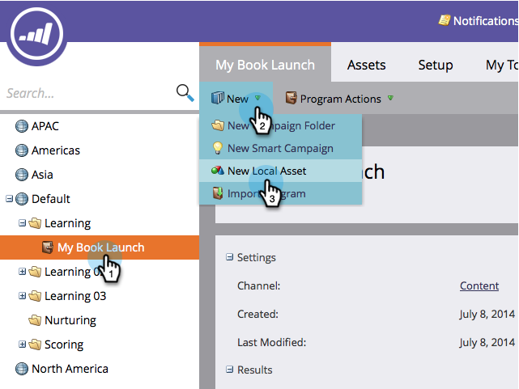
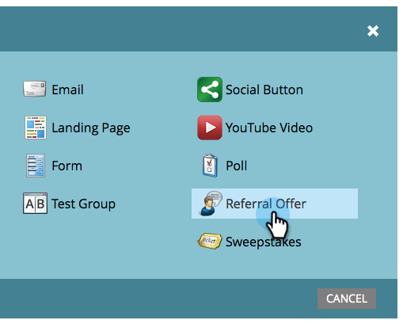
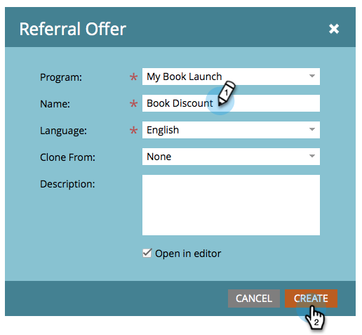
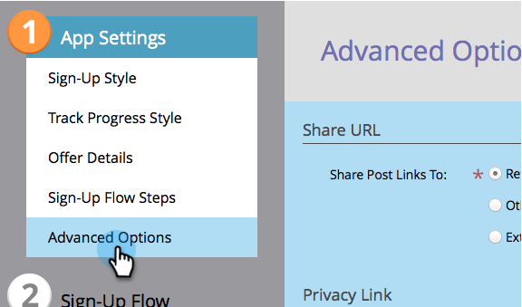
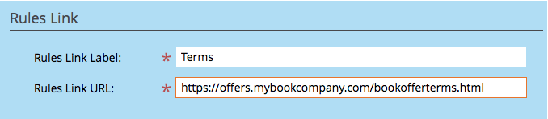
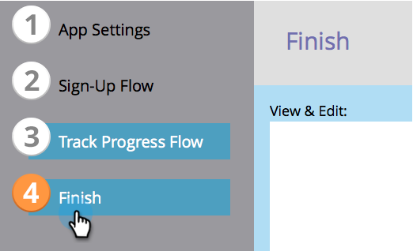
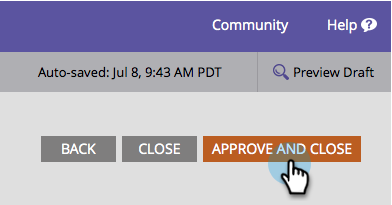

# Create a Referral Offer {#create-a-referral-offer}

Create a Referral Offer - Marketo Docs - Product Documentation

Referral offers give people an incentive to refer their friends. Create goals and rewards for successful referrals. You can drop it on landing pages, your website, and even Facebook.

>[!NOTE]
>
>**Availability**
>
>Not all customers have purchased this functionality. Contact your sales rep for details.

1. Inside your program, select **New** > **New Local Asset.**

   

1. In the **Local Asset Gallery,** click **Referral Offer.**

   

1. Name your referral offer.

   

   >[!TIP]
   >
   >To save time, you can use the **Clone From** option to copy all settings from an existing referral offer.

   The referral offer editor opens in a new window. The default settings are all good, but you need to add a link to your offer’s rules (terms and conditions). The link will appear in the bottom of share message screens. We’ll show you how in the next step. 

1. Click **Advanced Options.**

   

1. Add a link to the rules of your offer. Enter the **URL.**

   

   >[!NOTE]
   >
   >On this screen, you can also add a privacy policy link. See&nbsp; [Add Your Privacy Policy to a Social App](../../../../product-docs/demand-generation/social/social-functions/add-your-privacy-policy-to-a-social-app.md).

1. Click **Finish.**

   

1. Click **Approve** **and** **Close.**

   >[!TIP]
   >
   >To change any of the defaults in your referral offer, click&nbsp;**Back**. To save your work for later without approving, click&nbsp;**Close.**

   

If there are any problems in the referral offer, you'll be prompted to address them before the offer is approved.

Congratulations! You've created your referral offer.

>[!NOTE]
>
>**Related Articles**
>
>The next step is to [publish your referral offer](publish-a-referral-offer.md) on a landing page, on your website, or on Facebook.

>[!NOTE]
>
>**Deep Dive**
>
>All of the default settings, strings, and messages can be changed.

