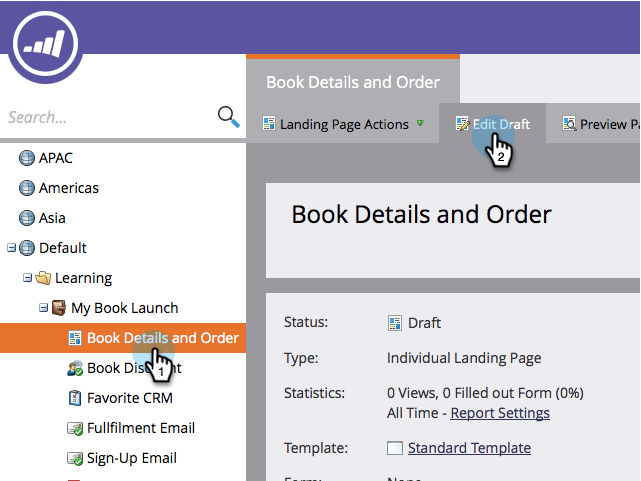
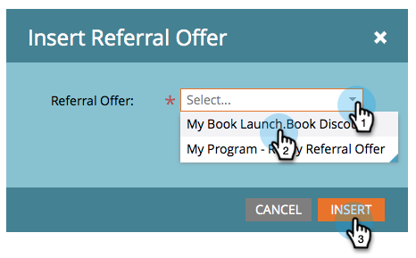

# Publish a Referral Offer {#publish-a-referral-offer}

Publish a Referral Offer - Marketo Docs - Product Documentation

After you [create a referral offer](create-a-referral-offer.md), you can publish it on your Marketo landing pages, on Facebook, and on your website.

1. Navigate to your landing page and open it for editing.

   

1. Drag over **Referral Offer** from the palette on the right.

   

1. Select your referral offer and click **Insert**.

   

>[!NOTE]
>
>**Reminder**
>
>You need to approve your referral offer in order to make it available here.

Congratulations! Approve the landing page and your referral offer is live. You can also [publish the landing page to Facebook](../../../../product-docs/demand-generation/facebook/publish-landing-pages-to-facebook.md) or [put the offer on your website](../../../../product-docs/demand-generation/social/social-functions/deploy-social-on-your-website.md). 

>[!TIP]
>
>Test and refine your referral offer. Go to the offer on your web page and sign up with test info. Make note of everything you want to change about the user’s experience.

