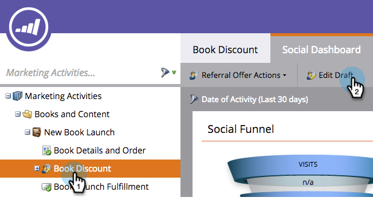
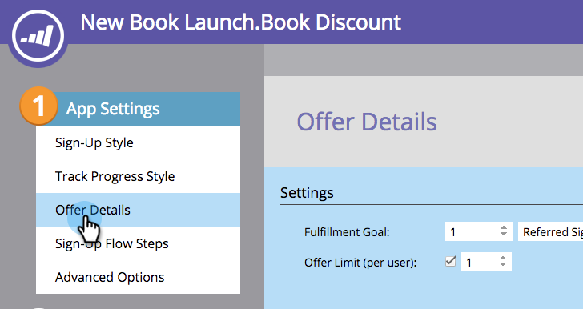
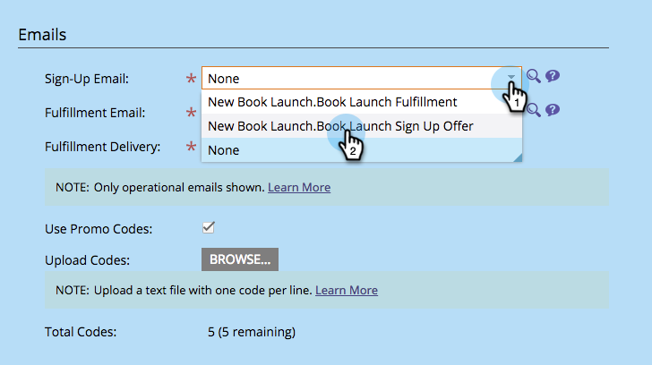
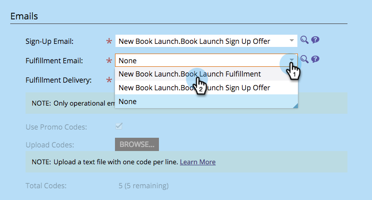
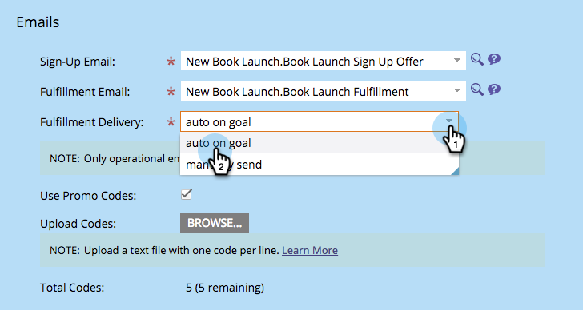
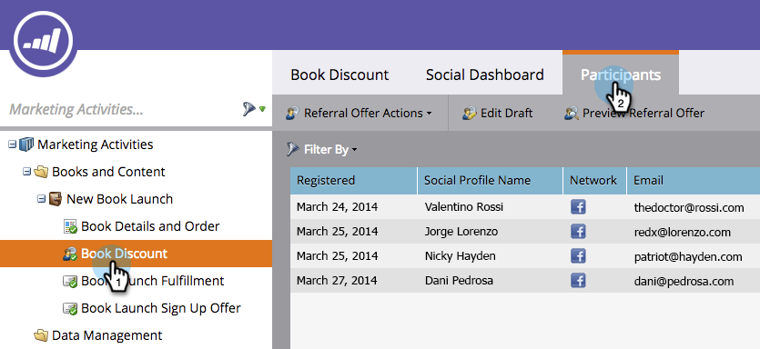
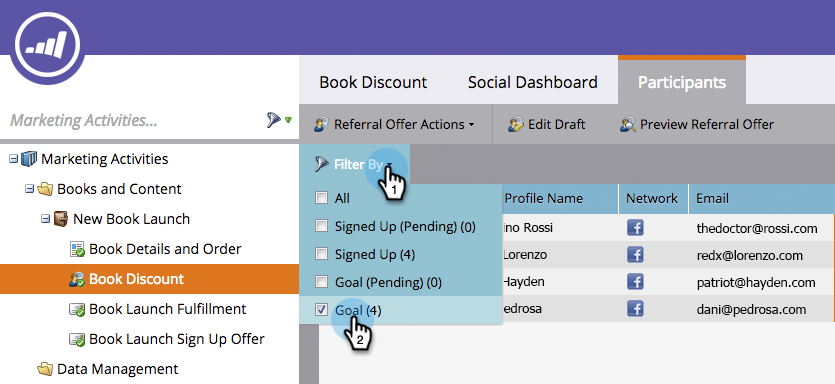
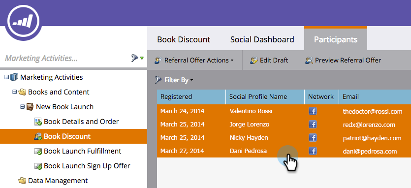

# Send Referral Offer Fulfillment Email {#send-referral-offer-fulfillment-email}

Send Referral Offer Fulfillment Email - Marketo Docs - Product Documentation

Reward your customers with coupons and discount codes using the offer fulfillment email.

>[!NOTE]
>
>**Prerequisites**
>
>* [Use Emails in Social Promotions](../../../../product-docs/demand-generation/social/social-functions/use-emails-in-social-promotions.md)
>* [Create a Referral Offer](create-a-referral-offer.md)
>

#### Set Up Fulfillment Delivery {#set-up-fulfillment-delivery}

1. Select the referral offer. Click **Edit Draft**.

   

1. Under **App Settings**, select **Offer Details.**

   ** 

   **

1. Select a **Sign-Up Email**.

   

1. Select a **Fulfillment Email**.

   

   >[!NOTE]
   >
   >**Deep Dive**
   >
   >
   >Learn more about [using emails in social promotions](../../../../product-docs/demand-generation/social/social-functions/use-emails-in-social-promotions.md).

1. Click the **Fulfillment Delivery** drop-down and select **auto on goal**.

   

   The message selected within **Fulfillment Email** will be automatically sent to people who meet the goal.

#### Manual Send {#manual-send}

You can send a fulfillment email manually to a person once they've met the goal.

1. Select the referral offer and click the **Participants** tab.

   

1. Click the **Filter By **option and select **Goal**.

   >[!NOTE]
   >
   >This selects people who have met the referral offer goal.

   

1. Select the people in the filtered view.

   

1. Right-click and select **Send Fulfillment Email**.

   

Awesome! Those people will now receive the fulfillment email and be stoked about their reward. 
