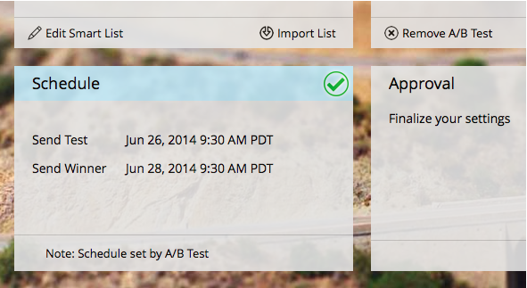

# Schedule the A/B Test {#schedule-the-a-b-test}

Schedule the A/B Test - Marketo Docs - Product Documentation

Once you have added an A/B test to an email program and defined the winner criteria you will need to schedule when the test begins. Here's how.

>[!NOTE]
>
>**Prerequisites**
>
>* [Add an A/B Test](add-an-a-b-test.md)
>

>[!NOTE]
>
>For Date/Time&nbsp;tests, you only need to set when you receive the test results summary.

##### 1. Select the Send Test date. {#select-the-send-test-date}

1. Select the **Send Test** time.

   

   >[!NOTE]
   >
   >Send Test and Send Winner must be at least 4 hours apart. However, for larger sends you may want to wait 24 hours to allow enough time to get good results.

1. Do the same thing for **Send Winner**. Enter notification recipients (optional) and click **Next**.

   >[!NOTE]
   >
   >**Reminder**
   >
   >
   >Only the test group will receive the test variants.

   

   >[!NOTE]
   >
   >If you chose to declare a winner manually, you will define&nbsp;**Report Send**&nbsp;date/time instead of&nbsp;**Finish Mailing**&nbsp;date/time.

   ##### Super! You're done, just review the summary and click Close. {#super-youre-done-just-review-the-summary-and-click-close}

   

   You'll notice the **Schedule** tile is now updated.

   

   >[!NOTE]
   >
   >Scheduling an A/B test also configures the final send date or the report send date.

   Assuming you already defined your audience and picked an email, the only step left is to approve the program.  

   >[!NOTE]
   >
   >**Related Articles**
   >
   >    
   >    
   >    * [Approve/Unapprove an Email Program](../../../../../../product-docs/email-marketing/email-programs/email-program-actions/approve-unapprove-an-email-program.md)
   >    
   >

