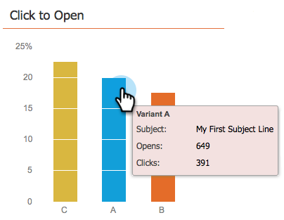

# Use the Email Program Dashboard - A/B Test View {#use-the-email-program-dashboard-a-b-test-view}

Use the Email Program Dashboard - A/B Test View - Marketo Docs - Product Documentation

Check out how your [email program A/B test](../../../../../../product-docs/email-marketing/email-programs/email-program-actions/email-test-a-b-test.md) is performing with this dashboard.

 

## Send Test {#send-test}

Here you can see the total delivered and the breakdowns by variants.

## Clicks {#clicks}

Here you can see how many clicks each variant has.
  

## Click to Open {#click-to-open}

This chart shows you the click to open ratio. (# clicks / # opens).

## Summary {#summary}

Here you can see a breakdown of clicks and unsubscribes by variants for easy comparison.

Cool dashboard, don't you think?

>[!NOTE]
>
>**Related Articles**
>
>* [Use the Email Program Dashboard](../../../../../../product-docs/email-marketing/email-programs/email-program-data/use-the-email-program-dashboard.md)
>

