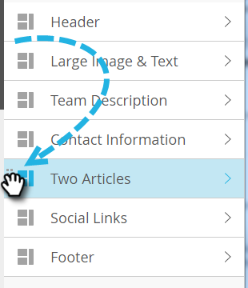

# Add Modules to your Email {#add-modules-to-your-email}

Add Modules to your Email - Marketo Docs - Product Documentation

In Email Editor 2.0, a module is a section of your email that is defined in the template. Modules may contain any combination of elements, variables, and other HTML content. Adding them to your email is easy.

1. Create an email. Be sure to choose (or create) a template that contains modules.

   

   >[!NOTE]
   >
   >Most of the Marketo Starter Templates contain Modules. You may also [create your own](http://docs.marketo.com/display/DOCS/Email+Template+Syntax#EmailTemplateSyntax-Modules).

1. On the far right of the email, click **Modules**.

   

1. Choose the module you want to add and drag it over to your email.

   

1. When you drag the module over you will see "Drop here" appear between the other modules. Drop your new module where you'd like.

   

1. Wait a few seconds, and your email will auto-refresh, revealing the module you added.

   

#### Moving a Module within an Email {#moving-a-module-within-an-email}

There are two ways to move a module.

1. Identify the module you want to move. If you're not sure what it's called, hover over it and it will be highlighted on the right.

   

1. Hover over the module on the right to reveal the handle. Grab it...

   

1. ...and drag the module to where you want it.

   

1. The other method is to click on the module in the email to select it, revealing the gear icon.

   

1. Click the gear icon, and select **Move Up** or **Move Down**, depending on where you want the module to go.

   

That's all there is to it.

>[!NOTE]
>
>**Related Articles**
>
>[Email Template Syntax](email-template-syntax.md)

