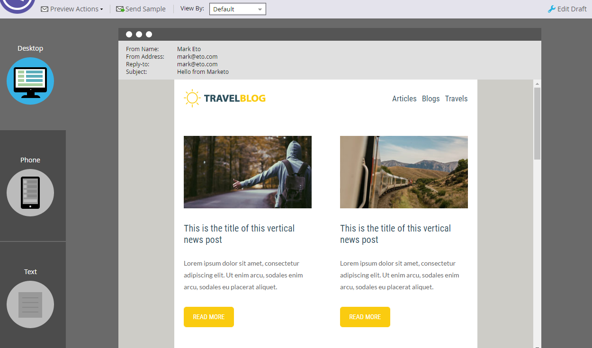
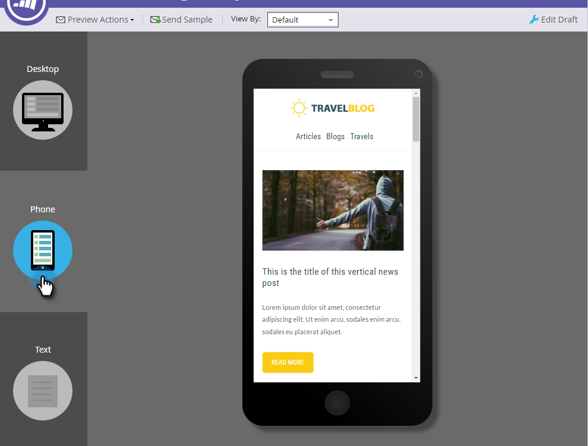

# Email Editor v2.0 Overview {#email-editor-v-overview}

Email Editor v2.0 Overview - Marketo Docs - Product Documentation

When you decide to activate the Email Editor v2.0, you'll notice several new features.

**Email Template Picker**

When you create a new email, you're taken to the [Email Template Picker](email-template-picker-overview.md).

**Email Editor**

When you start editing your email, you'll notice the editor has a whole new look.

**Modules**

Those things on the right side of the editor are called modules. Learn how to [add modules to your email](add-modules-to-your-email.md).

**Text Version**

Switching between the HTML version and Text versions of your email is now in a handy tab at the bottom. Learn how to [edit the text version of an email](../../../../product-docs/email-marketing/general/creating-an-email/edit-the-text-version-of-an-email.md).

**Email Header**

Want more design space? The email header can be hidden after you're done [editing it](../../../../product-docs/email-marketing/general/creating-an-email/edit-your-email-header.md). Simply click on this icon...

...and the header collapses.

**Preview your Email**

By default the email displays how it would look on a desktop, as indicated by the highlighted blue icon. If you click on the icon to its right...

...you'll see how your email will render on a mobile device.

For a larger preview, click **Preview** in the upper-right of the email.

The default view there is desktop...

...but you can also see how it will look on a mobile device. You can preview the text version, too! Simply click **Edit Draft** in the upper-right to resume editing.

**Email Actions**

Under **Email Actions**, you'll notice some new features. **Upload an Image or File**, and **Grab Images from Web**. You can also save the email itself as a new email template. All you have to do is give it a name and a destination.

>[!CAUTION]
>
>When saving an email as a template, variable values will not carry over. Variables will continue to use the defaults specified in the underlying template. Available modules in the email will also not carry over unless they been inserted into the email body.

>[!NOTE]
>
>** [Grab Images from Web](../../../../product-docs/demand-generation/images-and-files/grab-the-images-from-a-web-page.md)** works just like it does in the Design Studio.

**Disable Open Tracking** Under **Email Settings**, you can disable open tracking if necessary.

**Email Settings**

You have the option of adding a Preheader. A Preheader is the short summary text after the subject line when emails are viewed in your inbox.

>[!CAUTION]
>
>Tokens do not work in the Preheader when using the email editor. To use a token in the Preheader, it must be via your own HTML in an email template.

Lots of great new features! Have fun! 

>[!NOTE]
>
>**Deep Dive**
>
>If you want to delve even deeper, check out this [helpful video](https://nation.marketo.com/videos/1463).

>[!NOTE]
>
>**Related Articles**
>
>* [Email Template Syntax](email-template-syntax.md)
>

