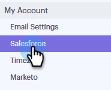
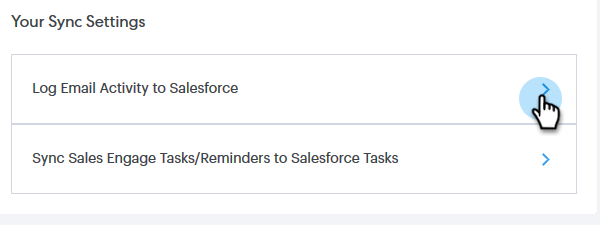
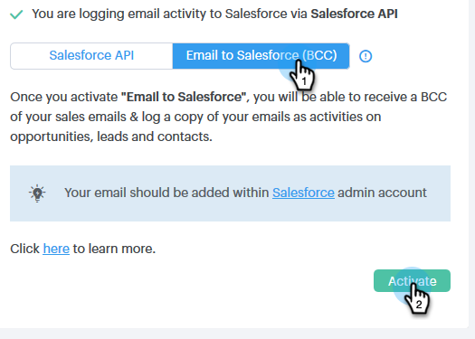

# Salesforce Sync Settings {#salesforce-sync-settings}

Salesforce Sync Settings - Marketo Docs - Product Documentation

### What's in this article? {#whats-in-this-article}

[Logging Email Activity to Salesforce via API](#logging-email-activity-to-salesforce-via-api)  
[Logging Email Activity to Salesforce via Email to Salesforce (BCC)](#logging-email-activity-to-salesforce-via-email-to-salesforce-bcc)  
[Sync Sales Engage Tasks/Reminders to Salesforce Tasks](#sync-sales-engage-tasks-reminders-to-salesforce-tasks)

#### Logging Email Activity to Salesforce via API {#logging-email-activity-to-salesforce-via-api}

This functionality requires you to be on the Enterprise/Unlimited edition of Salesforce, or the Professional edition if you've purchased Integration via Web Services API.

>[!NOTE]
>
>**Prerequisites**
>
>Salesforce and Sales Engage must be connected.

1. In Sales Engage, click the gear icon on the upper-right and select **Settings**.

   

1. Under My Account (Admin Settings if you're an Admin), click **Salesforce**.

   

1. Click the **Sync Settings** tab.

   

1. Click the arrow next to Log Email Activity to Salesforce.

   

1. Click the **Salesforce API** tab. In this card you can set up your preference for logging information to Salesforce. Click **Save** when done.

   

#### Logging Email Activity to Salesforce via Email to Salesforce (BCC) {#logging-email-activity-to-salesforce-via-email-to-salesforce-bcc}

Once you activate “Email to Salesforce (BCC)”, you'll receive a BCC of your sales emails and your emails will be logged as activities on opportunities, leads and contacts.

>[!NOTE]
>
>**Prerequisites**
>
>Salesforce and Sales Engage must be connected.

**To log your emails in Salesforce via Email (BCC)**

1. In Sales Engage, click the gear icon on the upper-right and select **Settings**.

   

1. Under My Account (Admin Settings if you're an Admin), click **Salesforce**.

   

1. Click the **Sync Settings** tab.

   

1. Click the **Email to Salesforce (BCC)** tab and click **Activate**.

   

If for some reason your Email to Salesforce address does not pull in, follow these steps to activate the BCC feature in your Salesforce account:

1. Log-in to your Salesforce instance.
1. Find your user name in the upper-right corner and select the drop-down bar.
1. Select **My Settings**.
1. Select **Email**.
1. Select **My Email to Salesforce**.
1. On this page, you'll see a field labeled "Email to Salesforce Address." If there is nothing populated next to it, scroll down to "My Acceptable Email Addresses."
1. Enter the email address(es) that you want BCC'd.
1. Click **Save Changes**.

**Can't Find My Email to Salesforce in My Settings**

If you don't see My Email to Salesforce under your Settings, your Admin may not have enabled it. This can happen if your team is new to Salesforce, or your team has never used the BCC address that Salesforce provides.

>[!NOTE]
>
>You will need Admin privileges to set this up.

1. Click **Setup*.* **
1. Click **Email Administration*.* **
1. Click **Email to Salesforce*.* **
1. Click **Edit**.
1. Check the box next to "Active*."*
1. Click **Save*.* **

#### Sync Sales Engage Tasks/Reminders to Salesforce Tasks {#sync-sales-engage-tasks-reminders-to-salesforce-tasks}

1. Click the gear icon on the upper-right and select **Settings**.

   

1. Under My Account (Admin Settings if you're an Admin), click **Salesforce**.

   

1. Click the **Sync Settings** tab.

   

1. Click the arrow next to Sync Sales Engage Tasks/Reminders to Salesforce Tasks.

   

1. Choose the desired option ("Do not sync to Salesforce tasks" is selected by default).

   

