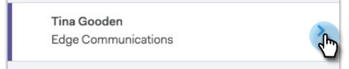

# Live Feed Overview {#live-feed-overview}

Live Feed Overview - Marketo Docs - Product Documentation

The Live Feed is a floating window that can be launched from the web application or the Gmail plug-in, and offers a real-time look at prospect engagement.

### What's in this article? {#whats-in-this-article}

[Engagement Tab](#engagement-tab)  
[Tasks Tab](#tasks-tab)  
[Target Tab](#target-tab)

#### Engagement Tab {#engagement-tab}

See engagement (views, clicks, and replies) with your MSE emails in real time.

People marked with purple are engaging with your marketing content. These people may not exist in MSE. You can click the down arrow to add them, and get a list of other quick actions.

People marked with a blue line represent engagement with emails sent through MSE.

#### Tasks Tab {#tasks-tab}

Quickly check your to-do list right from the Live Feed.

Create new or manage open tasks.

Filter on today, tomorrow, today *and* tomorrow, or next 7 days.

>[!NOTE]
>
>You cannot use the custom date filter in the Live Feed, but you can in the web application.

Use quick action buttons to quickly make a call, send an email, or navigate to a person's Linkedin profile. 

#### Target Tab {#target-tab}

See your top people (ordered from highest to lowest) ranked by lead score. The lead score is pulled over from your Marketo instance.

* Leads will be generated when their person score increases in Marketo.
* We show the top 50 leads.
* You will only see the people that have been assigned to you in Salesforce.

