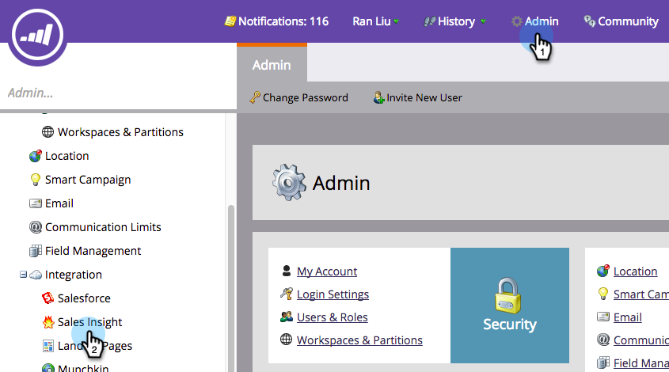
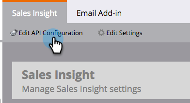
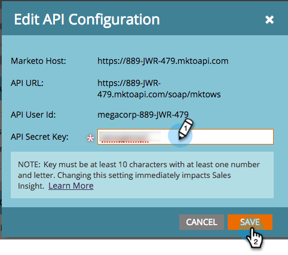
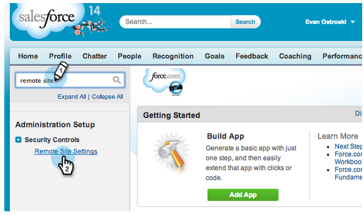
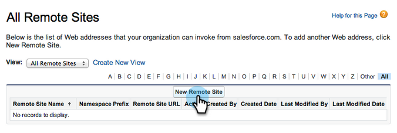
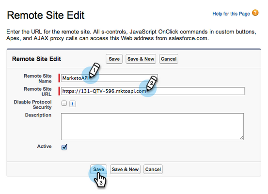
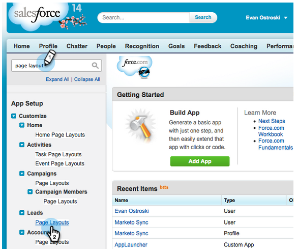
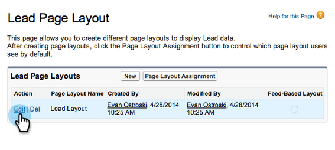
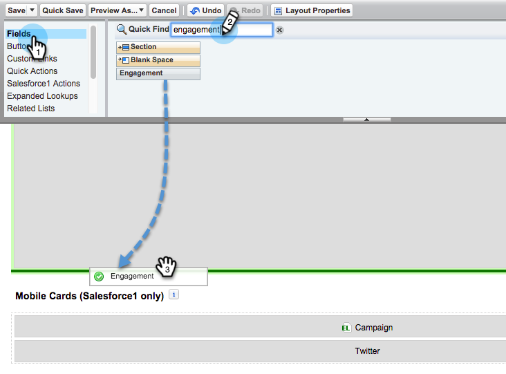
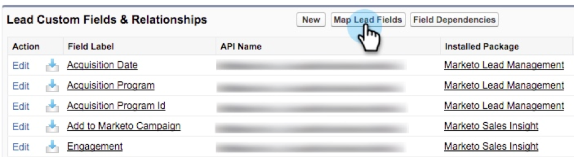

# Configure Marketo Sales Insight in Salesforce Enterprise/Unlimited {#configure-marketo-sales-insight-in-salesforce-enterprise-unlimited}

Configure Marketo Sales Insight in Salesforce Enterprise/Unlimited - Marketo Docs - Product Documentation

>[!NOTE]
>
>**Prerequisites**
>
>* [Configure Marketo field sync in your Salesforce Enterprise/Unlimited Edition](../../../../product-docs/crm-sync/salesforce-sync/setup/enterprise-unlimited-edition.md)
>* [Install Marketo Sales Insight Package in Salesforce AppExchange](../../../../product-docs/marketo-sales-insight/msi-for-salesforce/installation/install-marketo-sales-insight-package-in-salesforce-appexchange.md)
>

### What's in this article? {#whats-in-this-article}

[Configure Marketo Sales Insight](#configure-marketo-sales-insight)  
[Customize Page Layouts](#customize-page-layouts)  
[Map Custom Lead Fields](#map-custom-lead-fields)  
[Access Marketo Sales Insight](#access-marketo-sales-insight)

#### Configure Marketo Sales Insight {#configure-marketo-sales-insight}

1. Open a new web browser window to get the Marketo Sales Insight credential from your Marketo account.
1. Go to the **Admin** area. Select **Sales Insight**.

   

1. Click on **Edit API Configuration**.

   

1. Enter an **API Secret Key** of your choosing then click **Save**.

   >[!NOTE]
   >
   >Your API Secret Key is like a password for your organization and should be secure. **Caution**: Don't use an ampersand (&) in your API Secret Key.

   

   >[!TIP]
   >
   >You will need to enter these credentials in Salesforce, so keep this window open.

1. Back in Salesforce, click **Setup**.

   

1. Search for “remote site" and select **Remote Site Settings.**

   

1. Click **New Remote Site**.

   

1. Enter the **Remote Site Name** and **Remote Site URL** then click **Save**.

   >[!NOTE]
   >
   >Remote Site URL is the Marketo Host URL from the Edit API Configuration dialog window in the previous step.

   

#### Customize Page Layouts {#customize-page-layouts}

1. Use page layouts to set which fields are visible (accessible) to the users.

   >[!TIP]
   >
   >To limit access to a&nbsp;smaller set of users, follow the instructions in this article&nbsp; [Limit Sales Insight Access in Salesforce](https://nation.marketo.com/docs/DOC-1129).

1. Click **Setup**.

   

1. Search for "page layouts" and select **Page Layouts** under the **Leads** heading.

   

1. Click **Edit** for your Lead Layout.

   

1. Click **Visualforce Pages**. Drag **Section** to the layout underneath the **Custom Links** section.

   

1. Enter “Marketo Sales Insight” for the **Section Name**. Select **1-Column** and Click **OK**.

   >[!TIP]
   >
   >We recommend that you select 1-column layout.

   

1. Add the object element according to the object type (for instance, add Lead when you’re working on Lead Page Layouts).

   

1. Double-click on the object element that you just added.

   

1. Edit height to 450 pixels and click **OK**.

   >[!TIP]
   >
   >The height of 410 pixels is recommended for the Accounts and Opportunities objects.

   

1. Click on **Fields**&nbsp;on the left. Then search and drag **Engagement** into the Marketo Sales Insight layout.

   

1. **Repeat Step 10** for the following fields:

    * Engagement
    * Last Interesting Moment Date
    * Last Interesting Moment Desc
    * Last Interesting Moment
    * Last Interesting Moment Source
    * Last Interesting Moment Type
    * Relative Score
    * Relative Score Value
    * Urgency Value
    * View in Marketo

1. When finished, click **Save**.

   

1. Repeat steps 7-9 to add Visualforce page sections for **Contact**, **Account**, and **Opportunity**. Then repeat steps 10-12 to add Sales Insight fields for **Contact**. This is presuming you've already done both for **Lead**.

#### Map Custom Lead Fields {#map-custom-lead-fields}

Marketo lead fields need to be mapped to Salesforce contact fields to ensure no data gets lost during conversions.

1. Click **Setup**.

   

1. Search for "fields" in the search bar and click **Fields** under Leads.

   

1. Click **Map Lead Fields**.

   

1. Click on the dropdown on the right for **Engagement**.

   

1. Select **Contact.Engagement**&nbsp;in the list.

   

1. Repeat and map these fields as well.

<table> 
 <thead> 
  <tr> 
   <th colspan="1" rowspan="1"> 
    

      Marketo Person Custom Field 
    
</th> 
   <th colspan="1" rowspan="1"> 
    

      Salesforce Contact Custom Field 
    
</th> 
  </tr> 
 </thead> 
 <tbody> 
  <tr> 
   <td colspan="1" rowspan="1">
Engagement
</td> 
   <td colspan="1" rowspan="1">
Contact.Engagement
</td> 
  </tr> 
  <tr> 
   <td colspan="1" rowspan="1">
Relative Score Value
</td> 
   <td colspan="1" rowspan="1">
Contact.Relative Score Value
</td> 
  </tr> 
  <tr> 
   <td colspan="1" rowspan="1">
Urgency Value
</td> 
   <td colspan="1" rowspan="1">
Contact.Urgency Value
</td> 
  </tr> 
  <tr> 
   <td colspan="1" rowspan="1">
Last Interesting Moment Date
</td> 
   <td colspan="1" rowspan="1">
Contact.Last Interesting Moment Date
</td> 
  </tr> 
  <tr> 
   <td colspan="1" rowspan="1">
Last Interesting Moment Desc
</td> 
   <td colspan="1" rowspan="1">
Contact.Last Interesting Moment Desc
</td> 
  </tr> 
  <tr> 
   <td colspan="1" rowspan="1">
Last Interesting Moment Source
</td> 
   <td colspan="1" rowspan="1">
Contact.Last Interesting Moment Source
</td> 
  </tr> 
  <tr> 
   <td colspan="1" rowspan="1">
Last Interesting Moment Type
</td> 
   <td colspan="1" rowspan="1">
Contact.Last Interesting Moment Type
</td> 
  </tr> 
 </tbody> 
</table>

1. Click **Save** when you’re done.

   

#### Access Marketo Sales Insight {#access-marketo-sales-insight}

1. Go to **+** and click **Marketo Sales Insight Config**.

   

1. Check **Enable Marketo API**. Enter your Marketo credentials from the Marketo Admin section (which you kept handy from the first section).

   

   >[!TIP]
   >
   >If the diagnostics test failed, you might need to&nbsp; [add more fields to your page layout](https://nation.marketo.com/docs/DOC-1115).

1. Woohoo! You've just unlocked the powerful Marketo Sales Insight. You can see the details for all your leads, contacts, accounts and opportunities in the Marketo Sales Insight section.
  
   

>[!NOTE]
>
>**Related Articles**
>
>* [Priority, Urgency, Relative Score, and Best Bets](../../../../product-docs/marketo-sales-insight/msi-for-salesforce/features/stars-and-flames/priority-urgency-relative-score-and-best-bets.md)
>* [Add Marketo Sales Insight Tab and Buttons to Salesforce](../../../../product-docs/marketo-sales-insight/msi-for-salesforce/features/bulk-actions/add-marketo-sales-insight-tab-and-buttons-to-salesforce.md)
>* [Prepare Sales Insight for Multi-Lingual Support in Salesforce](../../../../product-docs/marketo-sales-insight/msi-for-salesforce/features/language-support/prepare-sales-insight-for-multi-lingual-support-in-salesforce.md)
>

