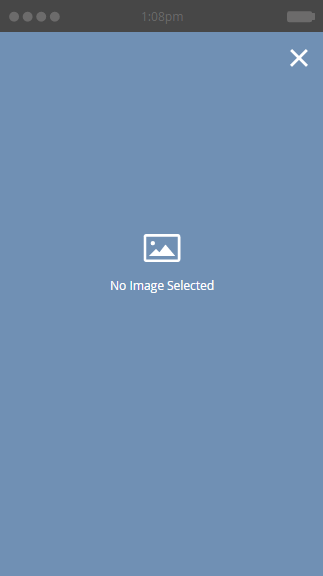
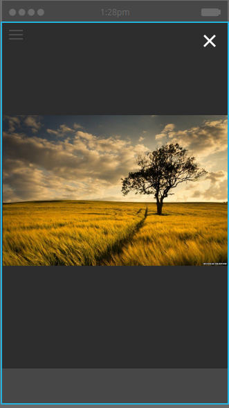
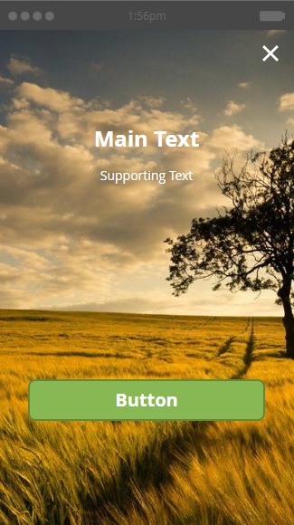
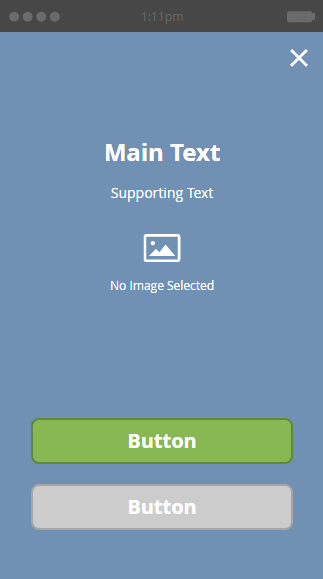

# Choose a Layout for Your In-App Message {#choose-a-layout-for-your-in-app-message}

Choose a Layout for Your In-App Message - Marketo Docs - Product Documentation

Marketo supplies six layouts for building in-app messages.

* Pop Up layouts are more traditional, and ideal if you don't have a creative team to supply content and you don't need a specific look and feel. You can easily create and edit your own in-app message, within Marketo
* Full Screen layouts let you import your own finished designs, giving you complete graphic flexibility

### What's in this article? {#whats-in-this-article}

[Pop Up Layouts](#pop-up-layouts)  
[Full Screen Layouts](#full-screen-layouts)

#### Pop Up Layouts {#pop-up-layouts}

The three Pop Up layouts all offer preset design elements, including an image, text, buttons, and a background.

The first Pop Up layout is the default selection for a good reason: It fits most uses. It works fine with lower resolution images. This layout uses the standard fonts for your platform (Helvetica for Apple, Roboto for Android), so it always looks right on a phone or tablet. You can upload and place the main and background images, write your own main and supporting text, and configure the main and dismiss buttons. Text is limited to three lines at 24 pixels. Larger type sizes reduces the number of lines.

The second Pop Up layout eliminates the text boxes, giving you more room for a taller image. Add text, in your choice of style, to the image before importing it, for a custom look.

The third Pop Up layout is great if you don't need to use an image in your in-app message. Two buttons offer message recipients a choice of actions. Text is limited to three lines. Larger type sizes will reduce the number of available lines.

#### Full Screen Layouts {#full-screen-layouts}

The three Full Screen style layouts are designed for you to import completed graphic artwork. Select your own fonts and embed them within the graphic to match any web page or promotion.

The first Full Screen layout offers a blank canvas. It displays exactly what you upload, without stretching or cropping the image (see example below). It shrinks to fit, leaving blank areas around it, depending on the image shape. No part of the image is removed.

Notice that this horizontal image displays its full width, leaving blank space above and below.

The second Full Screen layout adds text fields and a button.

Unlike the first Full Screen layout, this one, along with the third Full Screen layout (below), expands the placed image to fit the full height and trims the sides. Depending on the original image, this can create a compelling background image. This example uses the same image as the one shown above,

The third Full Screen layout is the same as the second, except for its second button. This provides more options for message recipients.

Now that you know about the templates, it time to choose one when you [create your in-app message images](add-in-app-message-images.md).

>[!NOTE]
>
>**Related Articles**
>
>* [Create an In-App Message](../../../../product-docs/mobile-marketing/in-app-messages/create-an-in-app-message.md)
>* [Understanding In-App Messages](../../../../product-docs/mobile-marketing/in-app-messages/understanding-in-app-messages.md)
>

