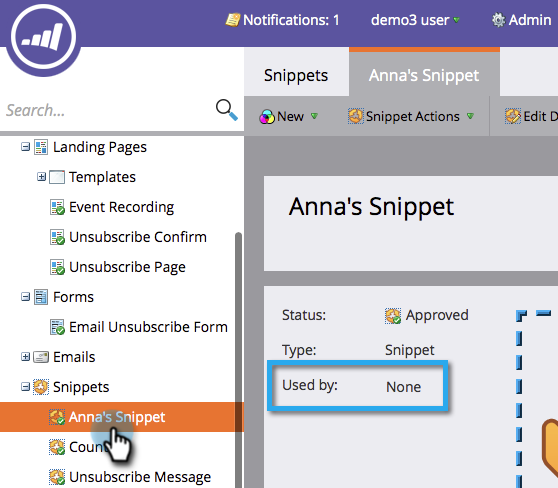

# Unapprove a Snippet {#unapprove-a-snippet}

Unapprove a Snippet - Marketo Docs - Product Documentation

An unapproved Snippet cannot be used in emails or landing pages.

1. Go to the **Design Studio.**

   

1. Go to your Snippet and make sure it is not **Used By** any assets.

   

   If your snippet is used by other assets, remove those associations before you proceed.

1. In **Snippet Actions**, click on **Unapprove**.

   

That's it! Your snippet is in draft status now for you to make changes or delete it.

