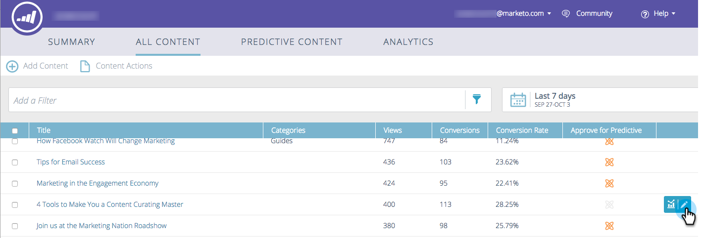
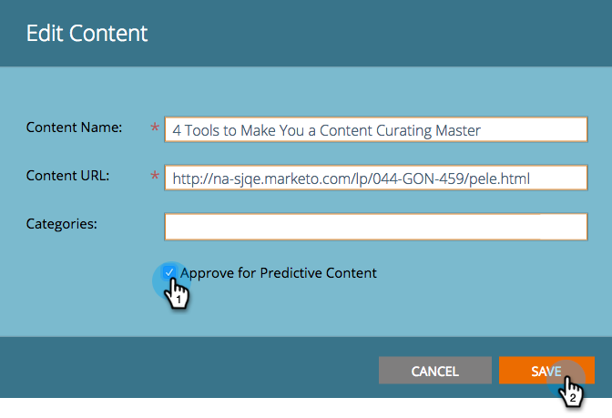
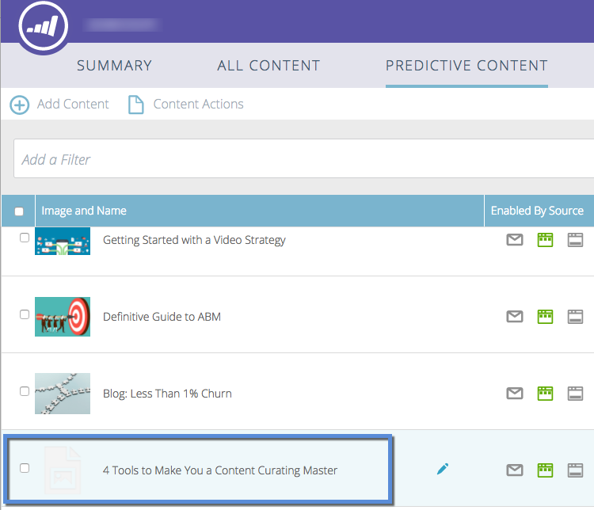

# Approve a Title for Predictive Content {#approve-a-title-for-predictive-content}

Approve a Title for Predictive Content - Marketo Docs - Product Documentation

>[!NOTE]
>
>Depending on the purchase date, your Marketo subscription may include either Marketo Predictive Content or Content`AI`. For those using Predictive Content, Marketo is enabling Content`AI` Analytics features until April 30, 2018. To keep these features beyond that date, please contact your Marketo Customer Success Manager to upgrade to Marketo Content`AI`.

You can add any title on your All Content page to predictive content by approving it on the All Content page or the Edit Content pop-up. 

#### All Content Page {#all-content-page}

1. Check the box next to the piece of content.

   

1. Click the **Content Actions** drop-down and select **Approve for Predictive Content**.

   

#### Edit Content Pop-up {#edit-content-pop-up}

You can also approve titles for predictive content directly on the Edit Content pop-up.

1. Hover over a piece of content and click the edit icon at the end of the row.

   

1. Check the **Approve for Predictive Content** box on the Edit Content popup and click **Save**.

   

##### Whichever way you use, the Approve for Predictive Content icon now appears in the row.  {#whichever-way-you-use-the-approve-for-predictive-content-icon-now-appears-in-the-row}

##### And you now can see the title displayed on the Predictive Content page. {#and-you-now-can-see-the-title-displayed-on-the-predictive-content-page}

