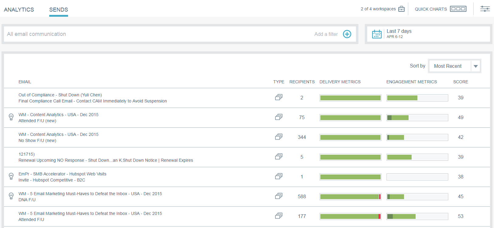

# Email Insights Sends Overview {#email-insights-sends-overview}

Email Insights Sends Overview - Marketo Docs - Product Documentation

On the Sends page, examine the characteristics of recent email communication.

Use [filtering](filtering-in-email-insights.md) to specify which emails you want to see.

On the right side of the page there are several pieces of information regarding your sent emails.

**Type** indicates the kind of asset used.   
**Recipient** number is how many people were sent the email.   
**Delivery Metrics** gives you a quick view of how many emails were delivered, are pending, or have bounced.  
**Engagement Metrics** gives you a quick view of how many recipients have opened, clicked in, and unsubscribed from an email.   
**Score** is your email's [Engagement Score](../../../product-docs/email-marketing/drip-nurturing/reports-and-notifications/understanding-the-engagement-score.md).

By default your emails are sorted by most recent, but you can sort them by any available metric.

>[!NOTE]
>
>Emails are listed by program or campaign name (top) and email asset name (bottom).

If you want to view your email's stats in Analytics, hover next to Score and click the chart icon.   

Cool stuff!

>[!NOTE]
>
>**Related Articles**
>
>[Email Insights Analytics Overview](email-insights-analytics-overview.md)

