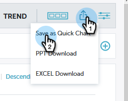
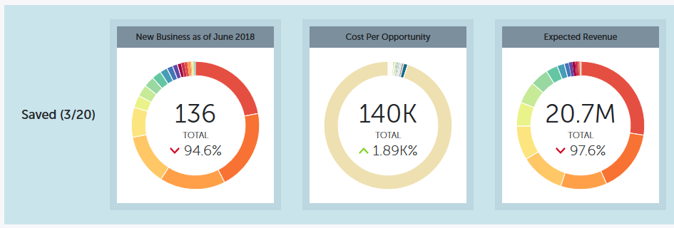

# Performance Insights Quick Charts {#performance-insights-quick-charts}

Performance Insights Quick Charts - Marketo Docs - Product Documentation

Quick Charts are thumbnails that you customize and save, providing a quick view of charts that you use the most.

### What's in this article? {#whats-in-this-article}

[Create a New Quick Chart](#create-a-new-quick-chart)  
[View Existing Quick Charts](#view-existing-quick-charts)  
[Delete a Quick Chart](#delete-a-quick-chart)

#### Create a New Quick Chart {#create-a-new-quick-chart}

Quick Charts derive from data you specify. In this example, we'll choose: **new opportunities (first touch), opportunity type = new business, current year-to-date**.

1. Click the date filter and choose **Current Year (YTD)**.

   

1. Click the **+** and select your criteria.

   

1. The chart updates to reflect the filters you've chosen.

   

1. Click the Export icon and select **Save as Quick Chart**.

   

1. Name your Quick Chart and click **Save**.

   

   ###### Your Quick Chart is now with the others. {#your-quick-chart-is-now-with-the-others}

   

   >[!NOTE]
   >
   >You can have up to 20 Quick Charts. They can be deleted and replaced.

#### View Existing Quick Charts {#view-existing-quick-charts}

1. To view your existing Quick Charts, simply click the **Quick Charts** icon.

   

#### Delete a Quick Chart {#delete-a-quick-chart}

If you need to delete a Quick Chart, follow these simple steps.

1. Click the **Quick Charts** icon.

   

1. Hover over the desired chart, but do not click on it. Upon hovering, an X will appear. Click the **X**.

   

1. Click **Delete**.

   

