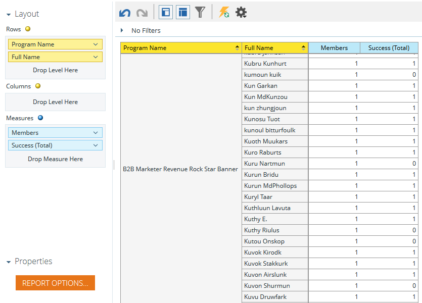

# Build a Program Membership Analysis Report that Lists Leads {#build-a-program-membership-analysis-report-that-lists-leads}

Build a Program Membership Analysis Report that Lists Leads - Marketo Docs - Product Documentation

Follow these steps to create a Program Membership Analysis report that will show you all program member names.

>[!NOTE]
>
>**Availability**
>
>Not all customers have purchased this functionality. Contact your sales rep for details.

##### 1. Launch Revenue Explorer. {#launch-revenue-explorer}

##### 2. Click Create New then Report. {#click-create-new-then-report}

##### 3. Select Program Membership Analysis and click OK. {#select-program-membership-analysis-and-click-ok}

  

##### 4. Find and double-click the Program Name yellow dot.  {#find-and-double-click-the-program-name-yellow-dot}

  

##### 5. Find and double-click the Members blue dot. {#find-and-double-click-the-members-blue-dot}

##### 6. Find and double-click the Success (Total) blue dot. {#find-and-double-click-the-success-total-blue-dot}

See how easy that was?

You can quickly add a lead attribute such as **Full Name** to see who the members are.

>[!TIP]
>
>There are plenty of lead/company attributes to pick from. Check them out!

##### 7. Find and double-click the Full Name yellow dot. {#find-and-double-click-the-full-name-yellow-dot}

There you have it!

