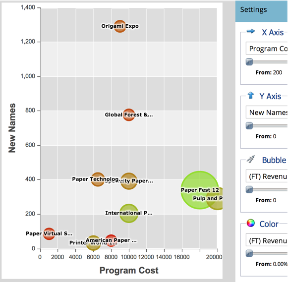

# Compare Program Effectiveness with the Program Analyzer {#compare-program-effectiveness-with-the-program-analyzer}

Compare Program Effectiveness with the Program Analyzer - Marketo Docs - Product Documentation

Use the Program Analyzer&nbsp;to identify your most and least effective programs, by comparing program costs, member acquisition, pipeline, and revenue.

>[!NOTE]
>
>**Prerequisites**
>
>* [Create a Program Analyzer](create-a-program-analyzer.md)
>

##### 1. Click on Analytics. {#click-on-analytics}

##### 2. Select your Program Analyzer. {#select-your-program-analyzer}

##### 3. Change the View to By Program. {#change-the-view-to-by-program}

##### 4. Use the Channel Filter to reduce the view down to just one or two channels. For now, we'll look at programs in the Tradeshow channel. {#use-the-channel-filter-to-reduce-the-view-down-to-just-one-or-two-channels-for-now-well-look-at-programs-in-the-tradeshow-channel}

>[!TIP]
>
>A quick way to filter programs to just one channel is to select&nbsp;**View > By Channel**, click the bubble for that channel, and then click the channel name in the pop-up dialog.&nbsp;

##### 5. Use the X Axis drop-down to choose a metric for the horizontal axis. We'll start with Program Cost. {#use-the-x-axis-drop-down-to-choose-a-metric-for-the-horizontal-axis-well-start-with-program-cost}

##### 6. Use the&nbsp;Y Axis&nbsp;drop-down to choose a metric for the vertical axis. Let's choose&nbsp;New Names&nbsp;to find programs that are good at capturing new leads. {#use-the-y-axis-drop-down-to-choose-a-metric-for-the-vertical-axis-lets-choose-new-names-to-find-programs-that-are-good-at-capturing-new-leads}

  

##### 7. Turn on the sliders to zoom in. {#turn-on-the-sliders-to-zoom-in}

>[!TIP]
>
>You can also try to improve your view by changing from a linear to a logarithmic scale, or vice versa. Use the&nbsp;**Scale**&nbsp;menu at the top.&nbsp;

##### 8. Explore the resulting graph. {#explore-the-resulting-graph}

In our example, we learn the Origami Expo is far better than all the other programs in that channel at capturing new names, and at a medium cost. But that's not the whole story. We'll add two more metrics to get a deeper understanding.

##### 9. Use the&nbsp;Bubble Size&nbsp;drop-down to choose a metric to compare by the size of the bubbles. We'll choose&nbsp;(FT) Revenue Won&nbsp;for our example. {#use-the-bubble-size-drop-down-to-choose-a-metric-to-compare-by-the-size-of-the-bubbles-well-choose-ft-revenue-won-for-our-example}

>[!NOTE]
>
>Many of the metrics you can choose in the program analyzer are available with first-touch (FT) and multi-touch (MT) calculations. It is important to understand the [difference between FT and MT attribution](../../../../product-docs/reporting/revenue-cycle-analytics/revenue-tools/understanding-attribution.md).

##### 10. Watch the bubbles change size in your graph. {#watch-the-bubbles-change-size-in-your-graph}

By adding** (FT) Revenue Won**, we see quickly that, while the Origami Expo acquired a lot of new names, it results in comparatively little revenue. Also, we see that the Paper Fest 12 program is getting fewer but better names, as it influences more revenue won (bigger bubble).

##### 11. Use the&nbsp;Color drop-down to add a fourth metric. We'll look at&nbsp;(FT) Revenue to Investment. {#use-the-color-drop-down-to-add-a-fourth-metric-well-look-at-ft-revenue-to-investment}

##### 12. Watch the colors change in your graph. {#watch-the-colors-change-in-your-graph}

We see that the Paper Fest 12 program not only influences more revenue (bigger bubble), but despite its relatively high program cost (on the far right side), it has the best return to investment (greenest bubble) of all the programs in the Tradeshow channel.

>[!TIP]
>
>You can quickly compare the programs in one channel with those in another. Just use the **Channel Filter** at the top of the window to add more channels.

>[!NOTE]
>
>**Related Articles**
>
>* [Explore Program & Channel Details with the Program Analyzer](explore-program-&-channel-details-with-the-program-analyzer.md)
>* [Compare Channel Effectiveness with the Program Analyzer](compare-channel-effectiveness-with-the-program-analyzer.md)
>

>[!NOTE]
>
>**Deep Dive**
>
>Learn more about advanced analytics in [Revenue Cycle Explorer](../../../../product-docs/reporting/revenue-cycle-analytics.md).

