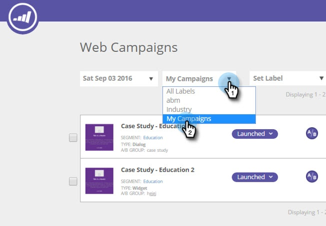

# Label Your Web Campaigns {#label-your-web-campaigns}

Label Your Web Campaigns - Marketo Docs - Product Documentation

### What's in this article? {#whats-in-this-article}

[Add a Label to a Web Campaign](#add-a-label-to-a-web-campaign)  
[Filter by Existing Labels](#filter-by-existing-labels)  
Do you have so many campaigns that scrolling is becoming cumbersome? Use labels to tag your campaigns, so you can sort them and find them quickly.

#### Add a Label to a Web Campaign {#add-a-label-to-a-web-campaign}

##### 1. Log into Web Personalization and go to the Web Campaigns area. {#log-into-web-personalization-and-go-to-the-web-campaigns-area}

>[!NOTE]
>
>To make it easier to find the campaign you want, use the [filter feature](filter-web-campaigns.md).

##### 2. Select the campaigns you want to tag with a label. {#select-the-campaigns-you-want-to-tag-with-a-label}

##### 3. Enter the desired label name and click Create New. {#enter-the-desired-label-name-and-click-create-new}

>[!TIP]
>
>If the label already exists, select it, and don't create a new one.

Cool! You now know how to create labels and assign them to campaigns.

#### Filter by Existing Labels {#filter-by-existing-labels}

1. Under the labels drop-down, select the label you want to use as a filter.

   

1. Now we only show you the campaigns that are associated to the selected label.

   

>[!NOTE]
>
>**Related Articles**
>
>* [L](create-a-new-in-zone-web-campaign.md) [abel a Segment](../../../product-docs/web-personalization/using-web-segments/label-your-segment.md)
>

