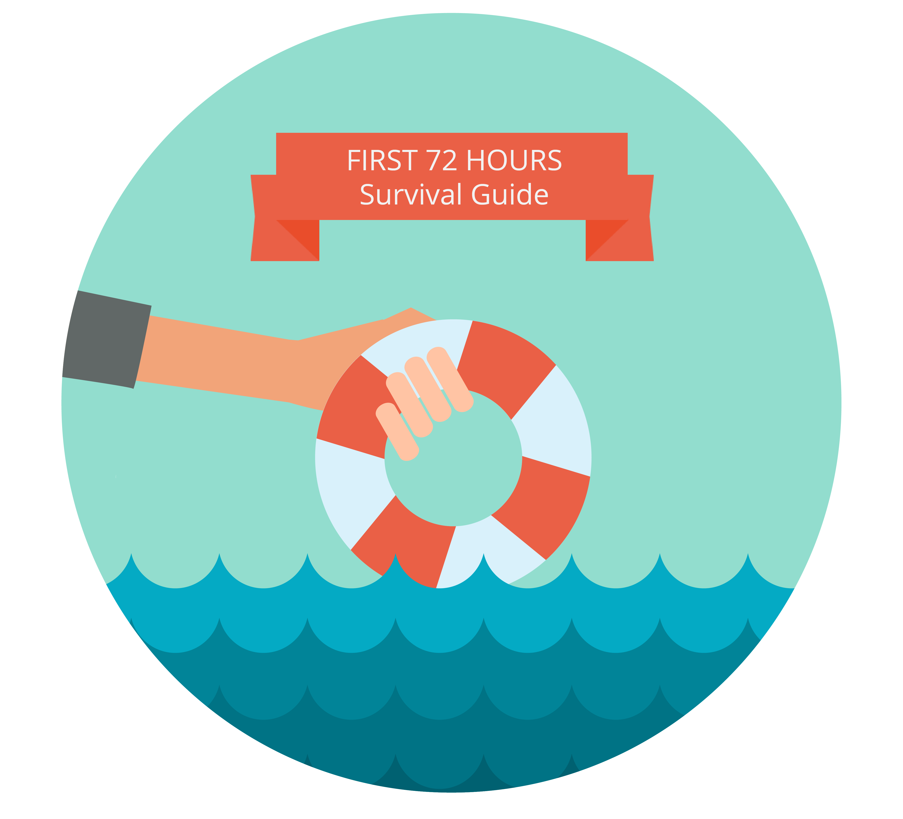

# Help! I've Inherited an Existing Marketo Instance {#help-i-ve-inherited-an-existing-marketo-instance}

Help! I've Inherited an Existing Marketo Instance - Marketo Docs - Product Documentation

**Are you a new user who just inherited an existing Marketo instance and don't know where to start?**

If so, this guide is meant for you.

It doesn't actually take 72 hours to go through it, of course, and it won't answer every question. But it could help you make the most of your first days with Marketo by pointing you in the right direction to get what you need.

So grab your favorite beverage and take a look around.

* [Items to Check Off](help!-i've-inherited-an-existing-marketo-instance/items-to-check-off.md)
* [Things to Review: Core Skills](help!-i've-inherited-an-existing-marketo-instance/things-to-review-core-skills.md)
* [Ways to Get Help](help!-i've-inherited-an-existing-marketo-instance/ways-to-get-help.md)

If you already know your way around your instance and are comfortable with Marketo core concepts, check out the [Product Docs](../../welcome-to-marketo-docs/product-docs.md) or visit the [Marketing Nation](https://nation.marketo.com) online community (username and password required) to see what other Marketo users are saying.

 
