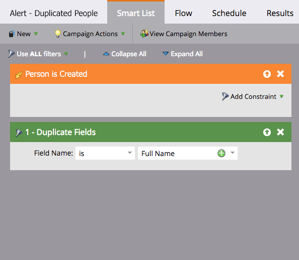
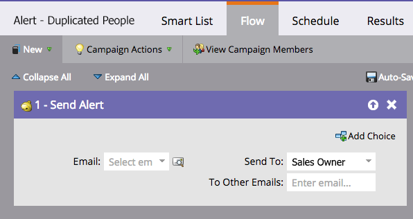
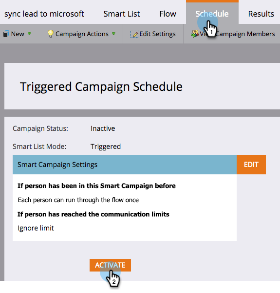

# Automate an Alert for Possible Duplicate People {#automate-an-alert-for-possible-duplicate-people}

Automate an Alert for Possible Duplicate People - Marketo Docs - Product Documentation

Want an alert every time possible duplicate person is created? Here is how to set up a Smart Campaign to do it.

>[!NOTE]
>
>**FYI**
>
>Marketo is now standardizing language across all subscriptions, so you may see lead/leads in your subscription and person/people in docs.marketo.com. These terms mean the same thing; it does not affect article instructions. There are some other changes, too. [Learn more](http://docs.marketo.com/display/DOCS/Updates+to+Marketo+Terminology).

1. [Create a new smart campaign](../../../../welcome-to-marketo-docs/product-docs/core-marketo-concepts/smart-campaigns/creating-a-smart-campaign/create-a-new-smart-campaign.md). Define the following smart list:

    * Trigger: **Person is Created**
    * Filter: **Duplicate Fields. **Field Name **is** **Full Name**.

   

   >[!TIP]
   >
   >Be creative. Experiment with different fields to get better filtering results.

1. In the flow step, choose [Send Alert](../../../../welcome-to-marketo-docs/product-docs/core-marketo-concepts/smart-campaigns/flow-actions/send-alert.md) flow action.

   

   >[!TIP]
   >
   >Using the [Send Alert Info token](../../../../welcome-to-marketo-docs/product-docs/email-marketing/general/using-tokens/use-the-send-alert-info-token-{{sp_send_alert_info}}.md) to include a link to the person in your CRM.

   >[!CAUTION]
   >
   >If you import a large list, you may get a bunch of these alerts all at once!
   >
   >
   >Also, two people with the same name doesn't automatically mean they are the same person.

1. Activate the campaign in the **Schedule** tab.

   

That's it! This smart campaign will trigger every time a new person with an existing full name is created in Marketo.

>[!NOTE]
>
>**Related Articles**
>
>* [Find and Merge Duplicate People](../../../../welcome-to-marketo-docs/product-docs/core-marketo-concepts/smart-lists-and-static-lists/managing-people-in-smart-lists/find-and-merge-duplicate-people.md)
>

