# Drip, Drip, Nurture {#drip-drip-nurture}

Drip, Drip, Nurture - Marketo Docs - Product Documentation

### Mission: Nurture the people who attended your recent tradeshow {#drip-drip-nurture-mission-nurturethepeoplewhoattendedyourrecenttradeshow}

You can easily create an advanced and sophisticated nurture system in Marketo. Here's how!

>[!NOTE]
>
>**FYI**
>
>Marketo is now standardizing language across all subscriptions, so you may see lead/leads in your subscription and person/people in docs.marketo.com. These terms mean the same thing; it does not affect article instructions. There are some other changes, too. [Learn more](http://docs.marketo.com/display/DOCS/Updates+to+Marketo+Terminology).

>[!NOTE]
>
>**Prerequisites**
>
>* [Get Set Up and Add a Person](get-set-up-and-add-a-person.md)
>* [Import a List of People](import-a-list-of-people.md)
>

### What's in this article? {#what-s-in-this-article}

[Step 1: Create an Engagement Program](#drip-drip-nurture-step1-createanengagementprogram)  
[Step 2: Create an Email](#drip-drip-nurture-step2-createanemail)  
[Step 3: Add Content to Your Stream](#drip-drip-nurture-step3-addcontenttoyourstream)  
[Step 4: Activate Stream Content](#drip-drip-nurture-step4-activatestreamcontent)  
[Step 5: Set the Stream Cadence](#drip-drip-nurture-step5-setthestreamcadence)  
[Step 6: Add a Test Person to Your Engagement Program](#drip-drip-nurture-step6-addatestpersontoyourengagementprogram)

#### Step 1: Create an Engagement Program {#drip-drip-nurture-step1-createanengagementprogram}

1. Go to the **Marketing Activities** area.

   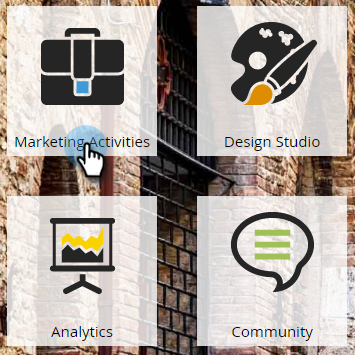

1. Select the **Learning** folder, click the **New** drop-down and select **New Program**.

   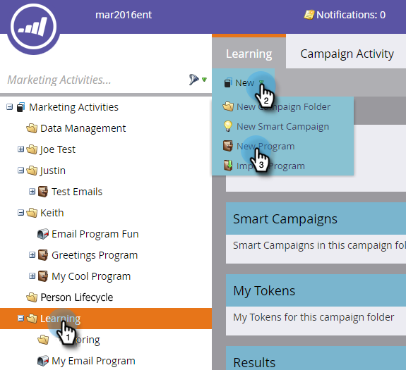

1. Enter a **Name** and select **Engagement** for the **Program Type**.

   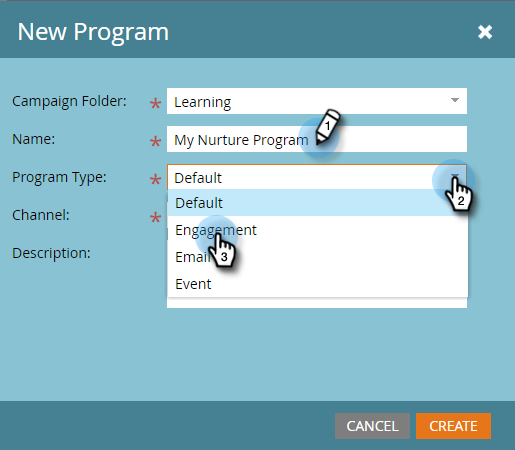

1. Make sure the **Channel** field is **Nurture** and click **Create**.

   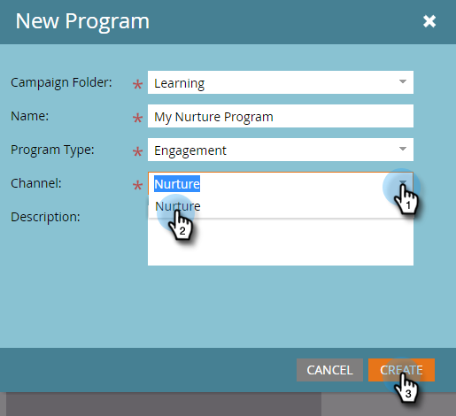

   You've now created an engagement program.

#### Step 2: Create an Email {#drip-drip-nurture-step2-createanemail}

1. Select your engagement program, then click **New** and select **New Local Asset**.

   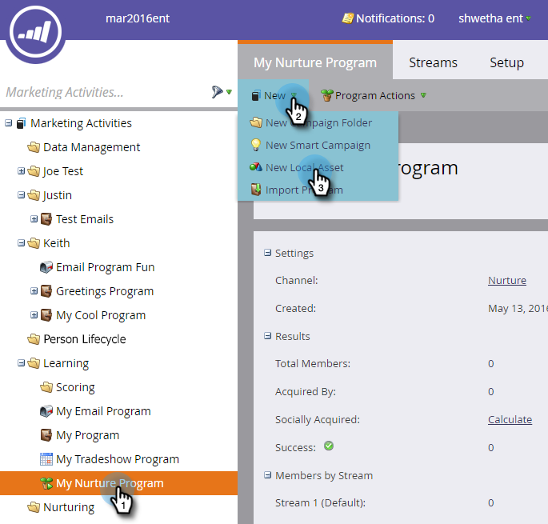

1. Click **Email**.

   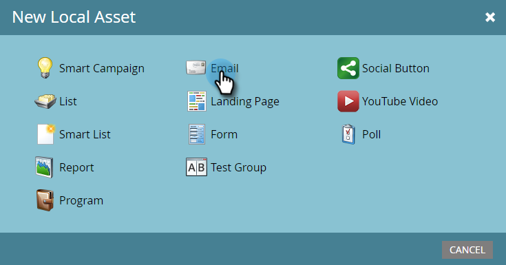

1. Enter a **Name**, select the **Template** you want to use, and click **Create**.

   

   >[!NOTE]
   >
   >Don't see the email editor? Your browser probably blocked the window. Enable pop-ups from [app.marketo.com](http://app.marketo.com) in your browser and click **Edit Draft** in the top menu bar.

1. Enter a subject.

   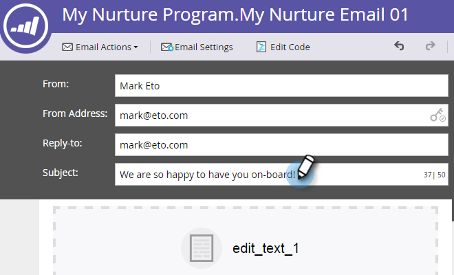

1. Select the area of the email you want to edit, click the gear icon and select **Edit**.

   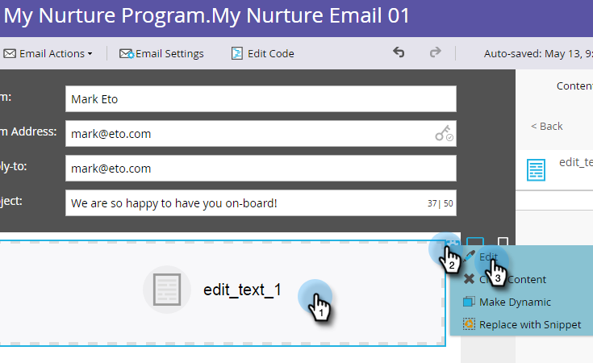

1. Edit your email and click **Save**.

   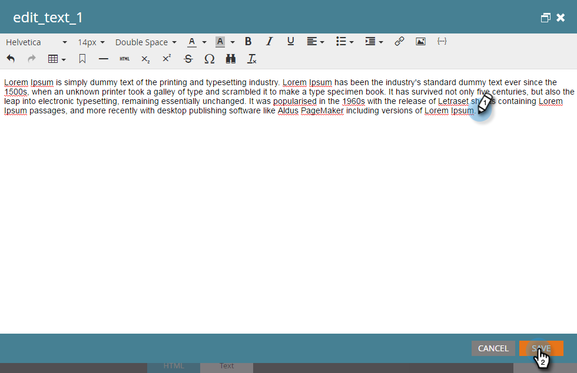

1. Close the email editor tab/window.

   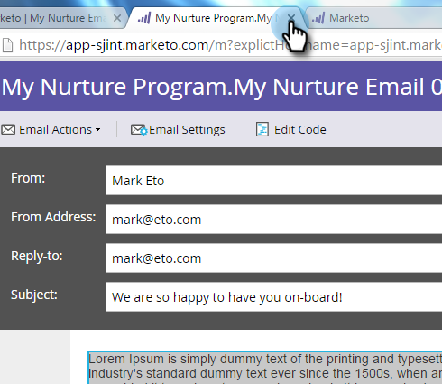

1. Under **Email Actions**, click **Approve**.

   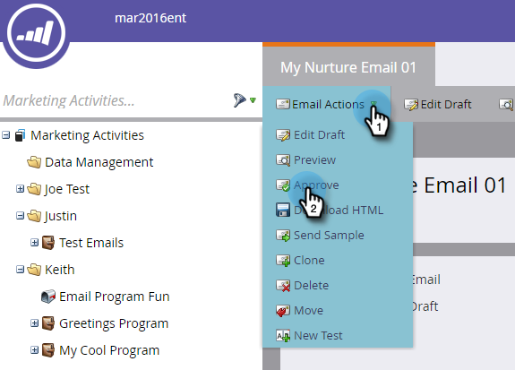

   >[!NOTE]
   >
   >**Reminder**
   >
   >
   >Don't forget to approve your emails or you won't be able to activate them later.

1. Now create another email by repeating the Step 2 actions.

   

#### Step 3: Add Content to Your Stream {#drip-drip-nurture-step3-addcontenttoyourstream}

1. Now it's time to create a stream of content for your engagement program using the emails you created.
1. Select your engagement program, and click on the **Streams** tab.

   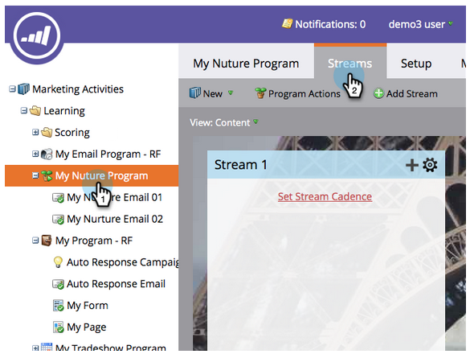

1. Drag the two emails you created to the right canvas.

   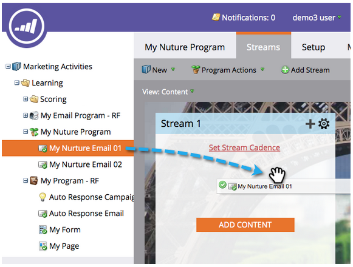

   >[!TIP]
   >
   >You can also use the **Add Content** button or the stream **+ ** icon.

#### Step 4: Activate Stream Content {#drip-drip-nurture-step4-activatestreamcontent}

1. Activate all content at once by clicking on the stream gear icon, then click  **Activate all content** .

   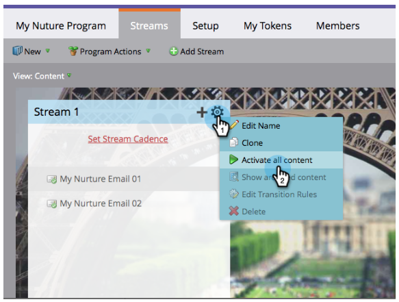

   >[!NOTE]
   >
   >You can't activate content without approving it first.

   Great work! One more step and the engagement program is ready.

#### Step 5: Set the Stream Cadence {#drip-drip-nurture-step5-setthestreamcadence}

1. Click **Set Stream Cadence**.

   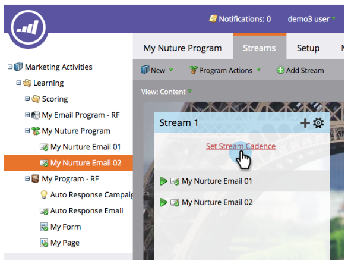

1. Edit the settings to match the schedule you want and click **SAVE**.

   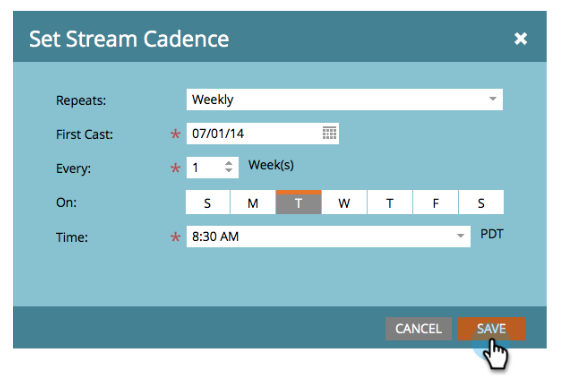

   Your engagement program is all set. Now let's add a test person to your program.

   >[!NOTE]
   >
   >The test person is the person who checks your engagement program to test that it's correct before sending to customers.

#### Step 6: Add a Test Person to Your Engagement Program {#drip-drip-nurture-step6-addatestpersontoyourengagementprogram}

1. Go to the **Database** area.

   

1. Search for your test person.

   

   >[!NOTE]
   >
   >Make sure the test person has a valid email address so you can confirm the receipt of emails when testing.

1. Right-click on the person, then click Programs and Add to Engagement Program.

   

1. Select your **Program** and **Stream**, then click **Run Now**.

   

1. Mission Complete!
1. You should receive email at the time and cadence you specified.

   >[!NOTE]
   >
   >**Deep Dive**
   >
   >
   >Learn more about [Engagement Programs](../../../welcome-to-marketo-docs/product-docs/email-marketing/drip-nurturing.md).

---

[◄ Mission 5: Import a List of Leads](import-a-list-of-people.md) [Mission 7: Personalize an Email ►](personalize-an-email.md) 