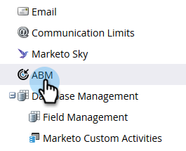

# Using Personas {#using-personas}

Using Personas - Marketo Docs - Product Documentation

Personas are a great way to segment your ABM audience and market to a specific subset of people.

### What's in this article? {#what-s-in-this-article}

[Add a Persona](#usingpersonas-addapersona)  
[View Your Personas](#usingpersonas-viewyourpersonas)  
[Persona Filters](#usingpersonas-personafilters)

#### Add a Persona {#usingpersonas-addapersona}

1. In My Marketo, click **Admin**.

   

1. In the tree, select **ABM**.

   

1. Click **Edit**.

   

   >[!NOTE]
   >
   >The Job Title persona is included by default. It cannot be modified or deleted.

1. To add additional personas, click **+Add**.

   

1. Give your persona a name, and select the corresponding field in the drop-down. You can add up to two additional personas. Click **Save** when done.

   

   >[!NOTE]
   >
   >Only Salesforce custom fields of type "picklist" that have been synced to your Marketo instance are available in the persona field drop-down when creating a persona.

#### View Your Personas {#usingpersonas-viewyourpersonas}

View your personas by visiting a specific Named Account.

1. Select the desired Named Account.

   

1. Click the **Personas** tab.

   

1. All of your personas are listed. Click on a number to see the list of people.

   

   >[!NOTE]
   >
   >The X in the Title Persona acts as a wild card character. For example, "CXO" will include CEOs, CFOs, etc.

#### Persona Filters {#usingpersonas-personafilters}

##### Use persona filters in a smart list to market to a specific group of people. {#usingpersonas-usepersonafiltersinasmartlisttomarkettoaspecificgroupofpeople}

