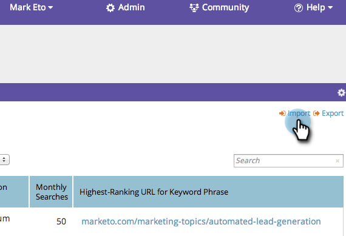
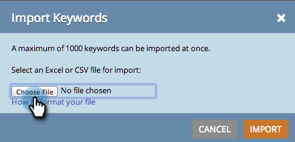
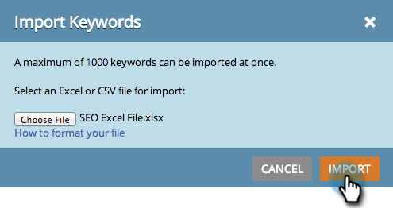

# SEO - Importing Keywords with a CSV {#seo-importing-keywords-with-a-csv}

SEO - Importing Keywords with a CSV - Marketo Docs - Product Documentation

1. You can [add keywords](seo-add-keywords.md) manually, [get keyword suggestions](seo-get-suggested-keywords.md) and even import keywords from a CSV file. Here is how to do the import.
1. Go to the **Keywords** section.

   

1. Click **Import**.

   

1. Choose an Excel file to import.

   

1. Click **Choose File**.

   

   >[!NOTE]
   >
   >Import limits vary depending on your subscription. Contact your sales rep for more information.

1. Click **IMPORT**.

   

   You should see your new keywords displayed on your keyword list in alphabetical order.

   

   It may take a few minutes to load all the data associated with each keyword. Meditate on the meaning of life.

   >[!NOTE]
   >
   >**Related Articles**
   >
   >    
   >    
   >    * [Understanding Keywords (Summary View)](seo-understanding-keywords.md)
   >    * [Add/Remove Keywords from a List](seo-add-remove-keywords-from-a-list.md)
   >    
   >

